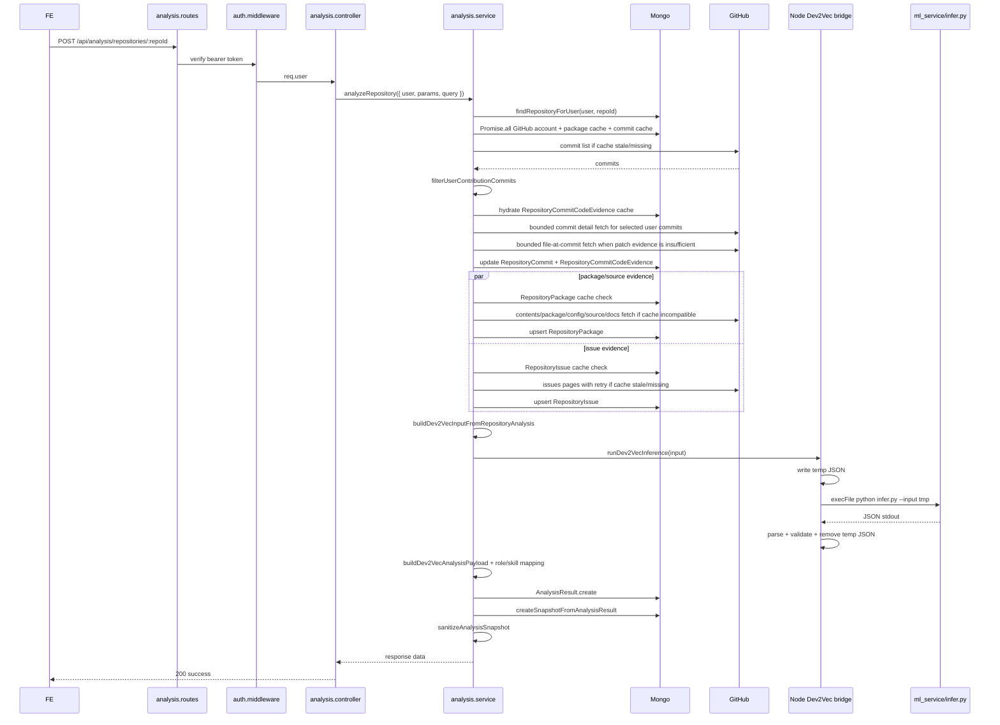

# 1. Executive summary

Audit scope: `POST /api/analysis/repositories/:repoId` in the current Backend source.

- Current production duration: **UNKNOWN from local audit**. The reported 2-3 minutes is user-observed, but this audit did not have authenticated Render logs or a real GitHub test account, so it is not treated as measured production evidence.
- Current significant stages: **14 stages** in the synchronous request path, with Python containing 4 internal sub-stages that are not fully split by current instrumentation.
- Most likely measured bottleneck candidates from source evidence: GitHub source/package fetch, commit detail/code evidence fetch, issue fetch retries/timeouts, and Python process-per-request inference. Exact top bottleneck still requires per-stage logs from a real analysis request.
- Render cold start vs pipeline: **not proven**. The source confirms Docker/Node/Python runtime and health endpoints, but no `render.yaml` or Render runtime logs exist in the repo. If every request takes 2-3 minutes after `/api/health` is warm, focus on the pipeline, not cold start.
- Production code was not changed. This report is the only created file for this audit.

Evidence used:

- Route: `src/routes/analysis.routes.js`
- Controller: `src/controllers/analysis.controller.js`
- Main service: `src/services/analysis.service.js`
- GitHub package/source: `src/services/github/github.package.service.js`
- GitHub commits/code evidence: `src/services/github/github.commit.service.js`
- GitHub issues: `src/services/github/github.issue.service.js`
- Dev2Vec Node/Python bridge: `src/services/dev2vec/dev2vec.service.js`
- Timing helper: `src/utils/dev2vecTiming.js`
- Models/indexes: `src/models/*.js`
- Deployment/runtime files: `Dockerfile`, `docker-compose.yml`, `server.js`, `package.json`

# 2. Current analysis flow



The flow is synchronous. The HTTP response waits for GitHub evidence, Dev2Vec inference, `AnalysisResult` save, `RepoAnalysisSnapshot` save, and sanitizer completion.

# 3. Stage timing breakdown

Current code already measures these phases when `DEV2VEC_TIMING_DEBUG=true`: `metadataMs`, `loadRepositoryContextMs`, `commitFetchMs`, `commitDetailFetchMs`, `packageSourceMs`, `issueMs`, `inputBuilderMs`, `inferenceTotalMs`, `mongoSaveMs`, `snapshotSaveMs`, and total.

| # | Stage | Function | Sequential/Parallel | External dependency | Cache | Duration | Percentage |
|---:|---|---|---|---|---|---:|---:|
| 1 | Authentication | `authMiddleware` | sequential | JWT only | none shown | UNKNOWN | UNKNOWN |
| 2 | Repository lookup | `findRepositoryForUser` | sequential | MongoDB | repository document | UNKNOWN | UNKNOWN |
| 3 | Context DB load | `GithubAccount.findOne`, `RepositoryPackage.findOne`, `RepositoryCommit.find` | parallel via `Promise.all` | MongoDB | package + commit records | UNKNOWN | UNKNOWN |
| 4 | Commit list loading | `loadRepositoryCommitsForAnalysis` -> `fetchAndCacheRepositoryCommits` | sequential pages | GitHub + MongoDB | 15 min commit cache | UNKNOWN | UNKNOWN |
| 5 | User commit matching | `filterUserContributionCommits` | in-process sequential | CPU | none | UNKNOWN | UNKNOWN |
| 6 | Commit detail/code evidence | `fetchAndCacheCommitDetailsForUserCommits` | bounded parallel, default 4 | GitHub + MongoDB | 24h detail cache + code evidence cache | UNKNOWN | UNKNOWN |
| 7 | Package/source evidence | `ensurePackageSourceEvidence` -> `fetchRepositoryPackages` | parallel with issues; inner source fetch bounded | GitHub + MongoDB | source evidence cache by branch/pushedAt/updatedAt/version | UNKNOWN | UNKNOWN |
| 8 | Issue evidence | `getRepositoryIssueEvidence` | parallel with package; pages sequential with retry | GitHub + MongoDB | 30 min issue cache | UNKNOWN | UNKNOWN |
| 9 | Dev2Vec input construction | `buildDev2VecInputFromRepositoryAnalysis` | synchronous CPU | none | no separate cache in analyze endpoint | UNKNOWN | UNKNOWN |
| 10 | Temp input write | `writeTempInput` inside `runDev2VecInference` | sequential | disk | none | UNKNOWN | UNKNOWN |
| 11 | Python process + model inference | `execFile(python, infer.py)` | sequential per request | Python/artifacts/CPU | no warm process | UNKNOWN | UNKNOWN |
| 12 | Output parse/validate/temp cleanup | `parseStdoutJson`, `validateDev2VecOutput`, `removeTempInput` | sequential | CPU/disk | none | UNKNOWN | UNKNOWN |
| 13 | Role/skill/payload mapping | `buildDev2VecAnalysisPayload` | synchronous CPU | none | none | UNKNOWN | UNKNOWN |
| 14 | Persistence + response | `AnalysisResult.create`, `createSnapshotFromAnalysisResult`, `sanitizeAnalysisSnapshot` | saves sequential | MongoDB | writes new analysis/snapshot | UNKNOWN | UNKNOWN |

Benchmark run during audit:

| Benchmark | Type | Result |
|---|---|---|
| `node scripts/benchmarkDev2VecPerformanceOptimizations.js` | mock, no live GitHub | 12 files, 25ms fetch + 12ms parse: sequential 567ms, bounded concurrency 93ms. Warm mock 187ms vs 16ms. Not production timing. |
| `node scripts/auditDev2VecCacheFlow.js` | cache policy fixture | compatible cache hits; forced, legacy, version mismatch, repository change, incomplete cache miss. |
| `node scripts/testDev2VecPerformanceOptimizations.js` | fixture test | passed. |

# 4. GitHub API call count

Approximate formula for a cold analyze request:

```text
totalCalls =
  commitPageCalls
  + commitDetailCalls
  + fileContentCallsFromCommitEvidence
  + packageConfigCandidateCalls
  + workflowDirectoryFileCalls
  + markdownDocCalls
  + controlledSourceListingCalls
  + controlledSourceFileCalls
  + issuePageCalls
```

Current default bounds from source:

| Type | Code path | Default / bound | Notes |
|---|---|---:|---|
| Repository metadata | `findRepositoryForUser` | 0 GitHub calls | Uses Mongo repository already synced. |
| Commit pages | `fetchGithubCommits` | up to 3 pages, 100/page | `GITHUB_COMMIT_MAX_PAGES`, capped at 10. |
| Commit detail per SHA | `fetchGithubCommitDetail` | up to 30 user commits | `GITHUB_COMMIT_DETAIL_MAX_COMMITS`, bounded concurrency default 4. |
| File at commit | `fetchFileAtCommit` | depends on selected files | Only when patch content unavailable/insufficient; bounded concurrency default 4. |
| Package/config candidates | `fetchRepositoryPackages` | about 30 root paths plus nested workflow/doc/source calls | Candidate loop is sequential. |
| Source directories | `addControlledSourceEvidenceFiles` | max 60 files | Root files fetched bounded; directories are traversed sequentially; file fetch inside a directory is bounded. |
| Issues | `fetchGithubIssuesWithRetry` | 2 pages x 50, 1 retry default | Timeout 8000ms per page attempt. |
| Branch/default branch | commit `sha` param from repository default branch | no separate branch endpoint | If branch differs, repository defaultBranch may be updated. |

N+1 risks found:

- Package/config candidate paths are fetched one-by-one in a `for...of` loop.
- `.github/workflows` directory contents are fetched, then each workflow file is fetched one-by-one.
- Markdown docs are fetched after root/doc directory listings, also sequential inside loops.
- Commit details are one GitHub request per selected user commit. This is intentional for file stats/evidence, but it is still N+1 by SHA.
- File-at-commit can become one GitHub request per selected file when patch evidence is missing.
- Source directory traversal calls GitHub contents repeatedly for each configured directory; many missing directories still cost requests.

# 5. Sequential vs parallel map

| Area | Current behavior | Comment |
|---|---|---|
| Initial DB context | Parallel | Good: GitHub account, package cache, commit cache are loaded in one `Promise.all`. |
| Commit list before commit details | Sequential dependency | Correct: details need selected commits. |
| User commit filter before detail fetch | Sequential CPU, before detail fetch | Good: source confirms details are fetched after user matching, not for all repo commits. |
| Commit detail fetch | Bounded parallel | Default 4, capped at 8. |
| Commit file-at-SHA fetch | Bounded parallel per commit | Default 4, capped at 8. |
| Package/source and issue evidence | Parallel via `Promise.allSettled` | Good: slow issue service does not block package start. |
| Package candidate paths | Sequential | Optimization opportunity. |
| Source root file fetch | Bounded parallel | Default 6, capped at 12. |
| Source directories | Sequential directory traversal | Optimization opportunity with care for rate limit. |
| Issue pages/retries | Sequential pages and retries | Safer for rate limit, can add short timeout/partial strategy. |
| Dev2Vec inference | One Python process per analysis | No parallelism; request waits. |
| Mongo saves | Sequential `AnalysisResult` then snapshot | Snapshot depends on result ID, so mostly justified. |

# 6. Commit analysis bottlenecks

Source-confirmed answers:

- The service fetches up to 100 commits per page and up to 3 pages by default for commit list.
- It filters user commits before fetching detail. `filterUserContributionCommits(commits, githubAccount)` runs before `fetchAndCacheCommitDetailsForUserCommits`.
- It does **not** intentionally fetch commit detail for non-user commits in the main analyze endpoint.
- Commit detail fetch is capped at 30 selected user commits by default.
- Commit detail concurrency is default 4 and capped at 8.
- Commit detail cache TTL is 24h.
- Commit list cache TTL is 15 minutes.
- Code evidence cache is stored per `repositoryId + sha + filename + evidenceVersion + fileSelectionVersion`.
- File-at-commit fallback exists and is bounded by per-file byte, total content byte, timeout, and concurrency.
- Patch parsing is preferred when available; full file fetch is fallback.
- Source byte safeguards exist: per-file 100KB, total 2MB, normalized embed 12MB.

Potential bottlenecks that need production timing:

- A repo with 30 user commits and missing patch data can trigger many commit detail calls plus file-at-commit calls.
- `RepositoryCommit.updateOne` is performed inside each commit detail worker. This avoids one giant write but adds Mongo round trips in the loop.
- The code evidence cache is per SHA+file. The same filename across multiple commits is fetched/analyzed separately because content can differ by SHA. A content hash cache could reduce repeat parsing only after safely proving identical content.

# 7. Source/package bottlenecks

Current source/package behavior:

- `fetchRepositoryPackages` first checks `RepositoryPackage` compatibility using default branch, `pushedAt`, `updatedAtGithub`, evidence builder version, and source parser version.
- If compatible, source evidence cache returns without GitHub fetch.
- If incompatible/missing, it fetches many candidate config/package paths sequentially.
- It fetches root markdown docs and docs directories separately.
- It fetches controlled root source files with bounded concurrency.
- It traverses configured source directories sequentially up to depth 2.
- It limits source evidence to 60 files by default and 4000 chars per source file.
- It excludes `node_modules`, `.git`, `vendor`, build/dist/coverage/out/target, Python venv/cache, lock files, minified/maps, model/joblib artifacts, `.env`, etc.
- It parses source usage once in `parseSourceUsageEvidence(sourceFiles)` and stores parser output in `rawData.__sourceUsageCache`.

Likely optimization areas:

- Batch candidate config path fetches with bounded concurrency.
- Avoid calling GitHub contents for many known-missing directories by preferring a tree API or cached root tree where available.
- Deduplicate root/doc/source fetches before requesting content.
- Cache negative path misses for the same repository fingerprint.
- Preserve source evidence semantics by keeping the same file selection rules and only changing fetch scheduling/caching.

# 8. Issue bottlenecks

Current issue behavior:

- Issue fetch runs on every analysis unless a fresh `RepositoryIssue` cache exists.
- Cache TTL is 30 minutes by default.
- It fetches all states, sorted by updated desc.
- Default max is 2 pages x 50 issues, selected down to 40.
- Timeout is 8000ms per page attempt.
- Retries default to 1 and are capped at 2.
- Pull requests are filtered out after GitHub returns the issues endpoint payload.
- User relevance is based on author or assignee matching GitHub username; otherwise repository fallback issues can be selected.
- Failures are swallowed into unavailable metadata and persisted as empty issue evidence.

Issue channel percentage: **UNKNOWN** without real `issueMs` timing logs. In the worst case with 2 pages and 1 retry, issue fetch can wait up to roughly 32 seconds from timeout alone, but that is an upper-bound derived from config, not observed production timing.

Recommended issue handling:

- Keep issue evidence in the contract.
- Keep running it parallel with package/source, as current code does.
- Add per-stage log fields for page count, retry count, timeout count, fetched/selected/relevant counts.
- Consider shorter timeout or stale-while-revalidate only after measuring issue contribution.
- Allow partial result when issue fetch fails, which current code already does at service level.

# 9. Dev2Vec/Python bottlenecks

Current Node/Python bridge:

- `runDev2VecInference` writes normalized input to `tmp/dev2vec-input-<requestId>.json`.
- It starts a new Python process for every analysis with `execFile`.
- It passes input by temp file path, not stdin.
- It waits for stdout JSON.
- It validates required output fields in Node.
- It removes the temp file best-effort.
- Default timeout is 30000ms.
- Default max stdout/stderr buffer is 10MB.
- Current Node instrumentation measures `writeTempInputMs`, `pythonProcessMs`, `removeTempInputMs` when `DEV2VEC_TIMING_DEBUG=true`.

Missing split:

- Python process startup.
- Artifact/model loading.
- Repo/issue/api vector inference.
- Classifier inference.
- Skill similarity mapping.
- Python serialization.

These can only be separated inside `ml_service/infer.py` or by converting Python inference into a warm service/worker that emits internal timings. Do not change vector dimensions, artifacts, role score, skill score, or score mapping.

# 10. MongoDB bottlenecks

Current query/index map:

| Query | Existing index | Assessment |
|---|---|---|
| Repository lookup by user + GitHub repo ID | `Repository { userId, githubRepoId } unique` | Good for numeric repo ID. Need inspect `findRepositoryForUser` for ObjectId path coverage; `_id` already indexed. |
| GitHub account by user | `GithubAccount.userId` unique field | Good. |
| Package cache by user + repository | `RepositoryPackage { userId, repositoryId } unique` | Good. |
| Commit cache by user + repository + branch sorted `authorDate` | index exists on `{ userId, repositoryId, branch, lastFetchedAt }` | Query sorts by `authorDate`, so the current index does not fully cover sort. Candidate index: `{ userId: 1, repositoryId: 1, branch: 1, authorDate: -1 }`. |
| Commit upsert by user + repository + sha | `RepositoryCommit { userId, repositoryId, sha } unique` | Good. |
| Commit evidence by repository + sha + evidence versions + filename | unique index and `{ repositoryId, sha, evidenceVersion }` | Good. Query also filters `fileSelectionVersion`; candidate compound index only if evidence cache query is slow. |
| Issue cache by user + repository | `RepositoryIssue { userId, repositoryId } unique` | Good. |
| Latest analysis by user + repository sorted by analyzedAt | `AnalysisResult { userId, repositoryId }` and `{ userId, analyzedAt }` | Candidate compound index: `{ userId: 1, repositoryId: 1, analyzedAt: -1, createdAt: -1 }` for latest per repo. |
| Snapshot by user + repository + createdAt | `RepoAnalysisSnapshot { userId, repositoryId, createdAt }` | Good. |
| Snapshot by analysisResultId | `RepoAnalysisSnapshot { analysisResultId }` | Good. |

Do not add indexes blindly. Add only after `explain()` or Mongo profiler confirms query time/scan count.

# 11. Cache effectiveness

| Cache | Key | TTL/version | Read before fetch? | Invalidated by |
|---|---|---|---|---|
| Repository metadata | `Repository { userId, githubRepoId }` or `_id` | no TTL shown | yes | repository sync updates |
| Package/source evidence | `RepositoryPackage { userId, repositoryId }` + source cache metadata | branch, `pushedAt`, `updatedAtGithub`, evidence builder version, source parser version | yes | branch/SHA metadata change or version change |
| Commit list | `RepositoryCommit { userId, repositoryId, branch }` | 15 minutes | yes | TTL expiry, branch change, missing cache |
| Commit detail | `RepositoryCommit` fields per SHA | 24 hours for legacy success/detail | yes | TTL expiry, missing detail, force refresh |
| Commit code evidence | `RepositoryCommitCodeEvidence { repositoryId, sha, filename, evidenceVersion, fileSelectionVersion }` | versioned, no TTL | yes | evidence/file selection version change, SHA/file change |
| Issue evidence | `RepositoryIssue { userId, repositoryId }` | 30 minutes | yes | TTL expiry, force refresh |
| Dev2Vec output | latest `AnalysisResult.dev2vec` used by role-match paths | metadata/fingerprint based | not used to skip new `POST /analysis` | force regenerate, legacy/incomplete, model/scoring/pipeline/fingerprint mismatch |
| AnalysisResult | new document each analyze | no TTL | read in result/roadmap/chat/feedback flows | new analysis supersedes by sort |
| Repository fingerprint | `pushedAt`, `updatedAtGithub`, default branch and pipeline metadata | metadata versioned | used in Dev2Vec cache policy | repository metadata change |

Common cache miss causes found:

- Source evidence cache misses when repository `pushedAt` or `updatedAtGithub` changes.
- Dev2Vec cache misses when model/scoring/pipeline metadata changes.
- Main analyze endpoint creates a new `AnalysisResult` and does not short-circuit on compatible Dev2Vec cache.
- Commit list cache expires after only 15 minutes.
- Force refresh exists in some paths and bypasses cache when used.

# 12. Render deployment factors

Repo-confirmed:

- No `render.yaml` was found.
- `package.json` start command is `node server.js`.
- `server.js` uses `process.env.PORT || 5000`.
- `Dockerfile` uses `node:20-bookworm-slim`, installs Python 3, creates `/opt/venv`, sets `DEV2VEC_PYTHON_BIN=/opt/venv/bin/python`, and defaults `DEV2VEC_TIMEOUT_MS=30000`.
- Health endpoints exist: `/health` and `/api/health`.
- Docker Compose exists for local API + MongoDB 7.

Unknown from repo:

- Render plan, CPU/RAM, region, instance sleep policy, autoscaling, disk behavior, runtime env values, MongoDB region, GitHub latency from Render region, and reverse proxy timeout.

Required separation:

- Cold start: measure from first request after sleep to `/api/health` ready and first analysis startup.
- Warm pipeline: hit `/api/health` first, then run analysis with `DEV2VEC_TIMING_DEBUG=true` and compare.

# 13. Root causes

P0 evidence-backed candidates:

- Package/source candidate fetch has sequential GitHub calls.
- Commit detail/code evidence can issue many GitHub calls, though bounded and user-filtered.
- File-at-commit fallback can multiply calls when patches are missing.
- Python starts a new process per analysis.
- Issue fetch has per-page timeout/retry and can add latency even when issues are not useful.
- Main analyze endpoint does not use compatible latest `AnalysisResult.dev2vec` as an early cache hit.

P1 candidates:

- No warm Python worker/service.
- No repository-level incremental analysis merge.
- No negative cache for missing config/source paths.
- No tree-based GitHub ingestion path.
- Timing logs are not structured per stage with cache/call counts.

P2 candidates:

- Synchronous HTTP request owns the full analysis lifecycle.
- No persisted job/progress state.
- GitHub ingestion, evidence building, and inference are tightly coupled to the user request.

# 14. Recommended optimization plan

| Priority | Optimization | Current bottleneck | Expected benefit | Risk | Files affected |
|---|---|---|---|---|---|
| P0 | Add structured per-stage instrumentation with request ID | Cannot rank bottlenecks from production | Enables evidence-based tuning | No score risk | `analysis.service.js`, `dev2vec.service.js`, GitHub services |
| P0 | Bounded parallel package/config candidate fetch | Sequential candidate path calls | Lower cold source fetch time | No result change if ordering/dedupe preserved | `github.package.service.js` |
| P0 | Log/count GitHub calls by type | No call-count visibility | Identifies N+1 and rate issues | No result change | GitHub services |
| P0 | Cache/skip compatible full analysis for no repository change | New analyze always reruns pipeline | Fast no-change/click-again path | No result change if fingerprint exact | `analysis.service.js`, cache policy |
| P0 | Deduplicate source/content fetch paths before download | Repeated doc/root/source paths possible | Fewer GitHub calls | No result change | `github.package.service.js` |
| P0 | Keep commit detail user-filter-first | Already implemented | Preserve current saving | No change | none |
| P0 | Bulk/batch Mongo writes where profiling shows loop overhead | Per-commit updateOne in worker | Lower Mongo round trips | Low if write semantics preserved | `github.commit.service.js` |
| P0 | Add missing sort-supporting indexes after profiler | Potential sort scan | Lower Mongo latency | Low with migration care | models/migration script |
| P1 | Warm Python worker or internal service | Process/model load every request | Reduces inference latency if startup/load significant | Medium operational complexity | `dev2vec.service.js`, `ml_service` |
| P1 | Repository evidence fingerprint cache | Rebuilds evidence often | Faster warm analysis | Low-medium; stale risk must be guarded | analysis/cache services |
| P1 | Incremental commit/evidence analysis | Full-ish fetch on repo updates | Avoids reprocessing old commits | Medium; merge correctness | commit/package/input builder |
| P1 | Per-stage timeout/partial policy | Slow issue/source channel can delay request | Better tail latency | Medium; evidence availability changes | GitHub services |
| P2 | Background job with progress | Long synchronous HTTP request | Avoids Render/proxy timeout and improves UX | High API/FE change | routes/controllers/jobs/worker/FE |

# 15. Expected impact and risks

| Optimization class | Result impact classification |
|---|---|
| Instrumentation/logging only | Does not change result. |
| Bounded parallel fetch preserving exact selected paths | Does not change result. |
| Exact fingerprint cache hit for unchanged repository and compatible model/pipeline metadata | Does not change result if fingerprint is complete. |
| Negative cache for missing paths | Does not change result if invalidated by repository fingerprint. |
| Warm Python service using same artifacts/code | Should not change result, but must regression-test byte/score equality. |
| Smarter source selection or lower issue/source limits | Can change evidence and may change role/skill scores. Treat as risky unless validated. |
| Background job | Does not need to change model output, but changes API/FE behavior. |

No estimate should be committed until before/after timings are collected on the same repo and cache state.

# 16. Incremental analysis design

Current fields that help:

- `Repository.defaultBranch`
- `Repository.pushedAt`
- `Repository.updatedAtGithub`
- `RepositoryCommit.sha`
- `RepositoryCommit.detailFetchedAt`
- `RepositoryCommitCodeEvidence` per SHA/file/version
- `AnalysisResult.dev2vec.cacheMetadata.repositoryFingerprint`
- pipeline/model/scoring/evidence/parser versions

Missing or incomplete:

- Explicit `defaultBranchSha` on Repository.
- Persisted `analyzedCommitShas` as a first-class indexed field.
- Repository evidence fingerprint document that records source file set, package paths, issue version, and model input hash.
- Merge strategy for old evidence plus new commits.

Safe incremental plan:

1. Store default branch head SHA during repository sync or commit fetch.
2. If branch SHA, `pushedAt`, `updatedAtGithub`, and pipeline/model metadata are unchanged, return compatible cached latest `AnalysisResult` for analyze requests unless force refresh is explicitly requested.
3. If branch SHA changed, fetch commit pages until reaching a known analyzed SHA.
4. Fetch detail/code evidence only for new user commits.
5. Reuse old code evidence for unchanged SHAs.
6. Rebuild Dev2Vec input from merged evidence and rerun inference so output remains based on the full contribution context.
7. Persist a new `AnalysisResult` and snapshot with provenance showing old/new evidence counts.

# 17. Synchronous vs background-job recommendation

Recommendation: optimize synchronous first with P0 instrumentation/cache/fetch scheduling. Move to background job only if measured warm pipeline still risks Render/proxy timeout or remains above the UX target.

Synchronous advantages:

- No FE contract change.
- Simpler failure handling.
- Existing controller/service shape remains valid.

Synchronous disadvantages:

- User waits for GitHub, Mongo, and Python.
- Render/proxy timeout risk remains if GitHub/Python tail latency is high.
- Hard to show granular progress.

Background job advantages:

- `POST analyze` can return `202 + jobId`.
- Worker can retry, persist stage progress, dedupe jobs, and recover after request disconnect.
- FE can poll `GET job/status` and `GET result`.

Background job costs:

- API contract change.
- FE changes for polling/progress/failure states.
- Need job persistence, duplicate suppression, cancellation policy, and worker concurrency limits.

# 18. Required code changes

Proposal only, no implementation in this audit:

- Add safe request correlation ID middleware or local analysis ID generator.
- Emit structured logs for every stage:

```json
{
  "event": "analysis_stage_completed",
  "requestId": "...",
  "repositoryId": "...",
  "stage": "commit_details",
  "durationMs": 12345,
  "itemCount": 20,
  "cacheHits": 8,
  "cacheMisses": 12
}
```

- Add GitHub call wrapper counters: endpoint type, duration, status, retry count, timeout flag.
- Add Python internal timings in `infer.py`: startup, artifact load, repo vector, issue vector, api vector, classifier, skill similarity, serialization.
- Add exact cache-hit response path for unchanged repository after verifying response contract.
- Add bounded concurrency for package/config candidate paths.
- Add optional profiler-backed Mongo indexes only after measuring scans.

Never log GitHub tokens, JWT, API keys, raw source, patches, full README/issue bodies, or full vectors.

# 19. Regression tests required

- Same repository, same cache state: role predictions and probabilities unchanged after fetch-scheduling changes.
- Skill gap matched/weak/missing names unchanged after fetch-scheduling changes.
- Dev2Vec input equality test for package/source path dedupe.
- Cache hit returns the same sanitized API shape as fresh analysis.
- Stale repository fingerprint forces rebuild.
- Issue failure still produces partial result without crashing.
- Commit detail fetch never includes non-user commits in main analyze endpoint.
- File-at-commit cache hit avoids GitHub call but preserves normalized evidence.
- Python warm worker output exactly matches process-per-request output for fixed fixture.

# 20. Benchmark plan

Run with `DEV2VEC_TIMING_DEBUG=true` and structured stage logs.

| Scenario | Current | After P0 | After P1 |
|---|---:|---:|---:|
| Small repo cold | UNKNOWN | ESTIMATE after implementation | ESTIMATE after implementation |
| Small repo warm | UNKNOWN | ESTIMATE after implementation | ESTIMATE after implementation |
| Medium repo cold | UNKNOWN | ESTIMATE after implementation | ESTIMATE after implementation |
| Medium repo warm | UNKNOWN | ESTIMATE after implementation | ESTIMATE after implementation |
| Cache hit | UNKNOWN | ESTIMATE after implementation | ESTIMATE after implementation |
| No new commit | UNKNOWN | ESTIMATE after implementation | ESTIMATE after implementation |

Benchmark rules:

- Same repository.
- Same user/token.
- Same Render service state: cold and warm separated.
- Same Mongo/cache state documented: cold, warm, cache-hit, force-refresh.
- Record commit count, user commit count, selected commit detail count, file count, issue count, source bytes, GitHub call count, cache hits/misses, Python timings, Mongo timings.
- Do not call external APIs in local mock benchmark and label mock data clearly.

# 21. Final recommendation

Do not start by changing model logic or dropping evidence channels. The fastest safe path is:

1. Turn on or add structured instrumentation so one real Render request exposes stage timing and GitHub call counts.
2. Confirm whether the 2-3 minutes is cold start, GitHub evidence collection, Python process/model load, or Mongo writes.
3. Apply P0 changes that do not alter Dev2Vec input semantics: exact cache hits, bounded parallel fetch scheduling, dedupe, and profiler-backed indexes.
4. Only then consider a warm Python worker or background job.

# Top 10 nguyen nhan co kha nang lam analysis mat 2-3 phut

Ranked by source evidence strength, not by measured production duration:

| Rank | Cause | Evidence strength | Runtime proof status |
|---:|---|---|---|
| 1 | Cold package/source fetch performs many GitHub contents calls | Strong source evidence | Timing UNKNOWN |
| 2 | Commit detail fetch is one GitHub call per selected user commit | Strong source evidence | Timing UNKNOWN |
| 3 | File-at-commit fallback can multiply GitHub calls | Strong source evidence | Timing UNKNOWN |
| 4 | Python process starts per analysis | Strong source evidence | Startup/load split UNKNOWN |
| 5 | Issue fetch can wait on page timeouts/retries | Strong source evidence | Timing UNKNOWN |
| 6 | Main analyze endpoint always writes a new result and does not early-return compatible cached Dev2Vec | Strong source evidence | Timing UNKNOWN |
| 7 | Source directory traversal probes many possible directories | Strong source evidence | Timing UNKNOWN |
| 8 | Per-commit Mongo updates inside detail workers add round trips | Medium source evidence | DB timing UNKNOWN |
| 9 | Commit query sort by `authorDate` may not be covered by current branch cache index | Medium source evidence | Explain/profiler needed |
| 10 | Render cold start or limited CPU/RAM | Deployment plausible | Not proven from repo |

# 10 toi uu it rui ro nhat

| Rank | Optimization | Result risk |
|---:|---|---|
| 1 | Structured per-stage logs with request ID | No result change |
| 2 | GitHub call counters and duration logs | No result change |
| 3 | Preserve user-commit-first detail fetch and assert with tests | No result change |
| 4 | Bounded parallel package candidate fetch preserving same candidate set | No result change |
| 5 | Deduplicate identical path requests within one source fetch | No result change |
| 6 | Exact fingerprint cache hit for unchanged repository/model/pipeline | No result change if fingerprint complete |
| 7 | Negative cache for missing paths tied to repository fingerprint | No result change if invalidated correctly |
| 8 | Add profiler-backed compound indexes | No result change |
| 9 | Bulk Mongo writes where semantics are identical | No result change |
| 10 | Python warm worker with equality regression tests | Low-medium operational risk, model output should remain same |

# Checklist cho Render

- Startup: measure first `/api/health` after sleep separately from analysis.
- Health: verify `/health` and `/api/health` return before benchmark.
- Node/Python: confirm Node 20 image or Render runtime, Python path, and `DEV2VEC_PYTHON_BIN`.
- Mongo region: record region relative to Render service.
- Cache: record cold/warm/cache-hit/force-refresh state before each run.
- Timeout: record Render request timeout, `DEV2VEC_TIMEOUT_MS`, issue timeout, commit content timeout.
- Logging: enable `DEV2VEC_TIMING_DEBUG=true` and structured stage logs.
- Memory: watch RSS during Python inference and artifact loading.
- Concurrency: set bounded values for commit detail, commit content, source fetch.
- Cold start: compare first request after idle with second request after warm health check.

# Checklist benchmark sau khi sua

- Same repository and same authenticated user.
- Same branch/default branch SHA.
- Same cache state label.
- Same model artifacts and pipeline metadata.
- Same env vars for concurrency and timeouts.
- Capture total request duration.
- Capture each stage duration.
- Capture GitHub calls by type.
- Capture cache hits/misses.
- Capture commit/user commit/detail/file/source/issue counts.
- Capture Python startup/artifact/vector/classifier/serialization timings.
- Compare role predictions, role score, skill score, top skills, missing skills, and response shape before/after.
