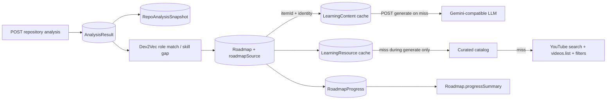
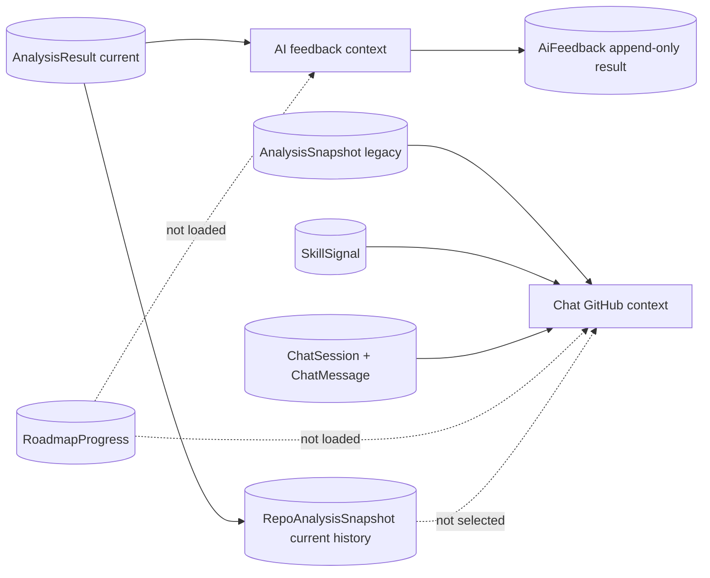

# 1. Executive summary

Audit date: 2026-07-14. Scope: backend source, generated Swagger, repository-provided regression harnesses, and a local startup attempt. No application code, database record, cache entry, or API contract was changed.

Evidence labels used below:

- **Source-confirmed**: traced through route/controller/service/model.
- **Harness-confirmed**: executed a repository-provided deterministic test without production data mutation.
- **HTTP blocked**: the backend was started with the existing `.env`, but MongoDB did not connect or fail within 40 seconds and no HTTP listener appeared. The process was terminated. Docker is unavailable. Therefore no claim below says that the full HTTP flow passed.
- **Not testable safely**: would require a real authenticated user, existing repository, external GitHub/LLM/YouTube calls, and database writes. The audit rules prohibit changing the database/cache.

Current conclusion:

- Analysis -> `AnalysisResult` -> `RepoAnalysisSnapshot` is internally coherent and ownership-scoped. Analysis returns both `analysisId` and the created `snapshotId`.
- Roadmap generation uses the latest `AnalysisResult` (or a merged set of latest results), not the newly created `RepoAnalysisSnapshot` document. It persists analysis/repository references inside the mixed `roadmapSource`; it does not reliably pin a real snapshot ID.
- Roadmap learning is a two-step contract. A newly generated roadmap does **not** contain generated learning. `GET .../learning/items/:itemId` returns 404 until `POST .../generate` succeeds. Only the generate endpoint searches curated/YouTube resources on cache miss.
- YouTube failures are converted to `resources: []` inside the roadmap adapter. This makes missing key, quota/network failure, all candidates filtered, and no result indistinguishable to FE.
- Completion is stored in a separate `RoadmapProgress` document and summarized into `Roadmap.progressSummary`; it is not stored in each roadmap task. Progress uses completed item count / total item count and ignores partial percentages.
- Flow 2 has a critical split source of truth: Chat reads the legacy `AnalysisSnapshot` model, while current analysis writes `RepoAnalysisSnapshot`; AI feedback reads the latest `AnalysisResult`. Chat accepts no snapshot/roadmap selector and loads no roadmap progress. Consequently Chat and feedback can describe different analysis states, and feedback cannot react to task completion.

Primary root causes for the reported symptom:

1. FE can treat roadmap creation as if learning was also generated, but backend requires an explicit item generate call.
2. GET learning never searches YouTube; POST generate does. Any GET-first UI gets 404 or cached resources only.
3. Roadmap resource lookup/search exceptions are swallowed and serialized as an empty array.
4. `itemId` is the required cross-flow ID. A Mongo `_id`, task index, or generic `task.id` cannot match.
5. Chat reads a different snapshot collection/model from the current analysis pipeline and has no roadmap/progress context.

# 2. Flow 1 architecture

Analysis details (source-confirmed):

- `POST /api/analysis/repositories/:repoId` resolves `repoId` through `findRepositoryForUser`, so the accepted identifier is either the Mongo repository `_id` or GitHub repository ID, but the stored `repositoryId` is Mongo `_id`.
- It loads the user's `GithubAccount`, repository package evidence and commits; matches the authenticated user's contributions; fetches commit details/code evidence; loads package/issue evidence; builds Dev2Vec input; runs inference; creates `AnalysisResult`; then creates `RepoAnalysisSnapshot` with `analysisResultId`.
- Analysis has no `forceRegenerate` input. Commit details use `forceRefresh: false`. `forceRegenerate` belongs to role matching, roadmap generation and learning generation.
- The analysis response is a sanitized `AnalysisResult` plus `snapshotId`. The `analysisId` is the result document `_id`; `snapshotId` is the snapshot document `_id`.
- Snapshot is append-only in this flow (`create` on every successful analysis); no update occurs during creation.

What roadmap later uses:

- Single repo: latest owned user-contribution `AnalysisResult` returned by `analysisSource.service`, with `roadmapSource.analysisId` and repository Mongo ID.
- Multi repo: a merged analysis built from the latest owned analysis per selected/all repository, with `analysisIds` and `repositoryIds`.
- Roadmap does not look up the `snapshotId` returned by analysis. Any `snapshotId` in its source summary is not a dependable foreign key to `RepoAnalysisSnapshot`.

# 3. Flow 1 endpoint map

All endpoints below require bearer authentication and enforce ownership by including `userId` in repository/roadmap/progress queries.

| Step | Method | Endpoint | Input | Main output | Status |
|---|---|---|---|---|---|
| Analyze | POST | `/api/analysis/repositories/:repoId` | owned Mongo `_id` or GitHub repo ID; `view`, `includeEvidence` query | analysis fields, `analysisId`, `snapshotId`, role/direction, level, top/missing skills | Source-confirmed; HTTP blocked |
| Role matches | POST | `/api/analysis/role-matches` | `sourceMode`, `repoId`/`repoIds`, `limit`, optional `forceRegenerate` | Dev2Vec role matches and analysis source | Source-confirmed |
| Generate roadmap | POST | `/api/roadmaps/generate` | required `targetRole`; source IDs; `roleId`, level, duration, language, matching and regeneration flags | compact roadmap; 201 new, 200 cached | Source-confirmed |
| List | GET | `/api/roadmaps/me` | optional `status`, `targetRole` | compact roadmaps | Source-confirmed |
| Detail | GET | `/api/roadmaps/:roadmapId` | owned roadmap ID | `{ roadmap: compactRoadmap }` | Source-confirmed |
| Availability | GET | `/api/roadmaps/:roadmapId/learning` | owned roadmap ID | item list with `learningStatus: available|missing` | Source-confirmed |
| Learning detail | GET | `/api/roadmaps/:roadmapId/learning/items/:itemId` | stable `itemId`; optional `includeResources` | task, learning, `resources`, personalized context, progress | 404 before generation; source-confirmed |
| Generate learning | POST | `/api/roadmaps/:roadmapId/learning/items/:itemId/generate` | stable `itemId`; `forceRegenerate`, `includeResources` | generated/cached learning plus resources | 201 generated, 200 cached; source-confirmed |
| Shared learning generate | POST | `/api/learning/skills/generate` | skill identity and context | shared cached content | Present in Swagger; not the preferred roadmap client route |
| Shared content | GET | `/api/learning/skills/:skillName` | role/level/language query | shared content | Present in Swagger |
| Shared resources | GET | `/api/learning/skills/:skillName/resources` | role/level/language/type | cached resources only | Present in Swagger |
| Resource search | POST | `/api/learning/skills/:skillName/resources/search` | role/level/language | curated or YouTube result | Present in Swagger |
| Get progress | GET | `/api/roadmaps/:roadmapId/progress` | owned roadmap ID | summary and item statuses | Creates/synchronizes progress record if absent |
| Mark/unmark | PATCH | `/api/roadmaps/:roadmapId/progress/items` | `itemId`, status, optional percent | full progress state | Source-confirmed |
| Reset | POST | `/api/roadmaps/:roadmapId/progress/reset` | owned roadmap ID | reset progress | Source-confirmed |

Swagger generation loaded successfully and contained every endpoint above with no reported generation errors.

# 4. Roadmap schema and ID mapping

| Identifier/field | Produced by | Stored/read as | Finding |
|---|---|---|---|
| `repoId` path/body | FE | Mongo `_id` or GitHub numeric ID at repository boundary | Resolved to owned Repository; stored downstream as Mongo `_id` |
| `analysisId` | `AnalysisResult._id` | `roadmapSource.analysisId` or `analysisIds[]` | Actual roadmap analysis pin |
| `snapshotId` | `RepoAnalysisSnapshot._id` | analysis response | Not reliably propagated to roadmap |
| `roadmapId` | `Roadmap._id` | route parameter and `RoadmapProgress.roadmapId` | Owned lookup uses `{_id,userId}` |
| `itemId` | normalization | task field and recomputed adapter value | Format `main-{phase+1}-{task+1}-{skill-slug}` or `alt-...`; learning/progress key |
| task Mongo `_id` | Mongoose subdocument | may exist internally because task schema does not disable `_id` | Not part of compact FE contract and not accepted by learning |
| `skillName` | task inference/canonicalizer | canonical display value | Backward fallback for progress only; ambiguous duplicates return 400 |
| `canonicalSkillName` | canonicalizer | task/content/resource identity | Preferred skill identity |
| learning content ID | `LearningContent._id` | internal cache document | Not exposed/required by roadmap item response |
| progress record ID | `RoadmapProgress._id` | internal | FE uses roadmap ID + item ID, not this ID |

Collections/shapes traced:

- Current roadmap tasks live at `mainRoadmap.phases[].tasks[]` (legacy fallback: `mainPath.phases[].tasks[]`).
- Alternative tasks live at `alternativeRoadmaps[].tasks[]`; legacy `supportingPaths[].suggestedTasks[]` are converted when the compact response is built.
- There is no top-level `roadmap.items[]` or `roadmap.tasks[]` contract.
- Both learning and progress recompute `itemId` from scope/index/canonical skill instead of trusting only the stored value. If phase/task order or canonical skill changes, the ID changes; progress sync attempts migration by canonical-skill + title signature.
- Task `resources` exists in the DB schema but roadmap normalization sets it to `[]`; learning resources come from `LearningResource`, not the task.
- Availability is not stored on a task. It is calculated by querying `LearningContent` for each task identity.

High-risk FE mapping: `task._id`, `task.id`, or array index is wrong. FE must read `mainRoadmap.phases[].tasks[].itemId` from the compact roadmap response and reuse it verbatim.

# 5. Learning content flow

Cache identity is:

`canonical skill + normalized target role + normalized level + content language`

The unique `LearningContent` index uses `normalizedSkillName`, `normalizedTargetRole`, `level`, and `language`.

Behavior:

1. Availability maps every roadmap task to that identity and returns `learningStatus`; it does not generate.
2. GET item resolves the owned roadmap and exact `itemId`, then calls shared `getLearningContent`. Cache miss throws 404: `Learning content not found. Please generate it first.`
3. POST generate resolves the same identity, reuses a cache hit unless `forceRegenerate === true`, otherwise builds an LLM prompt, parses strict JSON, sanitizes it, and upserts the same identity.
4. The response contains `title`, `overview`, `whyLearn`, `useCases`, `howToApply`, `examples`, `checklist`, `exercises`, `commonMistakes`, `nextSkills`, and `resources`.

The generate/write and GET/read queries match. The strongest content failure candidates are therefore calling GET before generate, wrong `itemId`, LLM/JSON parse failure, or a role/level/language identity change—not a different collection on write versus read.

Contract mismatch: the requested conceptual fields `summary`, `objectives`, `sections`, and `quiz` do not exist in the implemented learning model/response. Implemented equivalents are `overview`, `whyLearn`, `useCases`, `howToApply`, `checklist`, and exercises. FE expecting `summary`, `objectives`, `sections`, `quiz`, `video`, `videos`, or top-level `resources` will render empty.

# 6. YouTube resource flow

Resource identity differs from content only in language default: content defaults to `vi`; resource lookup defaults to `en`, plus `type=video`.

Flow during roadmap POST generate:

1. Read `LearningResource` cache.
2. Revalidate stale YouTube metadata; fail closed for stale YouTube entries.
3. If empty, query curated catalog using canonical skill/role/level/language/type.
4. If catalog is empty, require `YOUTUBE_API_KEY` and call YouTube `search.list` (`type=video`, max 4).
5. Call `videos.list` for metadata.
6. Require valid metadata, allowed privacy/embedding/duration/live/Shorts policy, pass safety checks, and score >= 40.
7. Save **only the best** YouTube candidate; curated lookup may save multiple.
8. Return resources under `data.learning.resources` for roadmap endpoints.

Important behavior:

- GET roadmap learning detail passes `searchIfMissing=false`; it only reads cache.
- POST roadmap learning generate passes `searchIfMissing=true`.
- Any resource error in the roadmap adapter is caught. It retries cache and finally returns `[]`. Missing key, invalid key, quota, network error, and provider error are hidden from FE.
- A valid configured key was detected without exposing its value. No external call was made because HTTP/database baseline could not start safely.
- Resource field names are `url`, `provider`, `thumbnailUrl`, and `channelTitle`. There is no `videoUrl`, `thumbnail`, or `videos` field.
- Stale, private, deleted, non-embeddable, duration-invalid, unsafe, or score-below-40 videos can all produce an empty array.

The deterministic moderation harness passed. The broader `testLearningCanonicalization.js` run emitted `FAIL: docker-compose: expected Docker Compose, got Docker Basics`; this is a fixture expectation failure unrelated to HTTP and must not be treated as a flow pass.

# 7. Completion and progress flow

Completion is stored only in `RoadmapProgress.items[]` with `itemId`, status, percent, `startedAt`, `completedAt`, and timestamps. The service also writes the calculated summary into `Roadmap.progressSummary`.

Formula:

`overallProgress = round(completedItems / totalItems * 100)`

- Partial `progressPercent` does not contribute to overall progress.
- Status values: `not_started`, `in_progress`, `completed`.
- Setting completed forces 100; uncomplete clears `completedAt`; reset clears all dates.
- Repeating completed is functionally safe but replaces `completedAt` with the current time, so it is not strictly idempotent in representation.
- Updates are two sequential writes (`RoadmapProgress.save`, then `Roadmap.updateOne`), not a Mongo transaction. A failure between them can temporarily desynchronize the detail summary and progress endpoint.
- GET progress synchronizes task additions/removals and rewrites the roadmap summary. Hidden tasks are not explicitly modeled; all extracted main and alternative tasks count.
- Zero tasks yields 0, avoiding division by zero.
- No double increment exists because progress is recomputed from statuses.
- `roadmap.progress` is only a legacy formatting fallback; current authoritative fields are `RoadmapProgress.overallProgress` and `Roadmap.progressSummary.overallProgress`.

# 8. Flow 1 reproduced results

| Step | Runtime action/result | IDs/DB result | Verdict |
|---|---|---|---|
| Start service | `npm start`; no output/listener after ~40 seconds; terminated | none observed | HTTP blocked at Mongo connection |
| POST analysis | Not sent because server never listened | none | Not tested |
| POST roadmap | Not sent | none | Not tested |
| GET roadmap/detail/availability | Not sent | none | Not tested |
| POST/GET learning | Not sent | none | Not tested |
| YouTube search | Not sent; secret presence only checked | none | Not tested externally |
| Completion/progress | Not sent to avoid DB mutation outside a valid HTTP baseline | none | Not tested |
| Swagger load | Loaded `src/config/swagger`; required paths present, no spec errors | n/a | Pass |
| Roadmap skill-gap harness | All four assertions passed, including canonical tasks/progress extraction | in-memory fixtures | Harness pass |
| YouTube moderation harness | Passed | in-memory fixtures | Harness pass |
| Learning canonicalization harness | One fixture failed: docker-compose canonicalization | in-memory fixtures | Partial/fail |

No token, URI, source payload, or secret was recorded.

# 9. Flow 1 root causes

| Severity | Classification | Exact finding |
|---|---|---|
| P0 | response contract mismatch / content not generated | Roadmap creation does not generate learning; GET returns 404 before explicit generate |
| P0 | FE sends wrong ID (probable integration risk) | Backend requires compact response `itemId`; task Mongo ID/index cannot resolve |
| P0 | YouTube API/config error hidden | Roadmap adapter collapses all search/cache errors into `resources: []` |
| P1 | FE calls wrong sequence | GET does cache-only resource lookup; search occurs only during POST generate |
| P1 | response contract mismatch | Resources are `learning.resources[]`, URL is `url`, thumbnail is `thumbnailUrl`; no `videos`/`video` |
| P1 | progress update consistency | Separate non-transactional writes can leave roadmap summary stale after partial failure |
| P1 | cache key mismatch risk | Exact role, level, content language and resource language participate in lookup |
| P2 | DB schema/ID stability | `itemId` is index-derived and changes if task order or canonical skill changes |
| P2 | API/provider parsing | Learning generation requires valid JSON from LLM; parse errors propagate and save nothing |
| P2 | stale cache/filtering | YouTube metadata revalidation fails closed and safety/relevance threshold can remove all results |

# 10. Flow 2 architecture

# 11. Snapshot source-of-truth analysis

There are two distinct snapshot models:

- Current analysis writes `RepoAnalysisSnapshot`, linked by `analysisResultId`, with Dev2Vec metadata.
- Chat imports and queries `AnalysisSnapshot`, a legacy collection/model. Current `analyzeRepository` does not create it.

Roadmap source of truth is latest `AnalysisResult` at generation time. It persists analysis IDs, so the roadmap can remain pinned to analysis A after a new analysis B exists, although downstream learning uses only fields stored in the roadmap.

Chat source of truth is a fresh query at every message over up to five newest legacy `AnalysisSnapshot` records plus current Repository/Package and SkillSignal data. There is no request field for `snapshotId`, `repositoryId` is not accepted by the validator contract, and a new session does not store a selected snapshot.

AI feedback source of truth is latest `AnalysisResult` with Dev2Vec for the owned repository; `RepoAnalysisSnapshot` is only a fallback. The saved `analysisSnapshotId` is misleading when the source is `AnalysisResult`: it stores `AnalysisResult._id`, not a snapshot `_id`.

No component calculates repository staleness by comparing current head/pushed timestamp with `analyzedCommitShas`. Old analysis is not marked stale.

# 12. Chat and feedback context map

| Context | Chat | AI feedback |
|---|---|---|
| userId | Authenticated owner | Authenticated owner |
| repository | Up to five current user repositories | One owned repository selected by path ID |
| analysis | Up to five legacy `AnalysisSnapshot`s | Latest Dev2Vec `AnalysisResult` |
| selected snapshot ID | Unsupported | Unsupported; latest chosen internally |
| roadmap ID/context | Not loaded | Not loaded |
| progress/completion | Not loaded | Not loaded |
| learning content/cache | Not loaded | Not loaded |
| chat history | Last six messages in session | Not loaded |
| profile | Student profile included | Not loaded |
| response persisted | user + AI `ChatMessage`; metadata has provider/model/intent/source | New `AiFeedback` every POST; GET returns latest |
| cache | No explicit AI response cache | No generation cache; every POST generates/fallback-saves |

Chat response exposes session/message IDs (`_id`), role, metadata and timestamps, but no snapshot, repository or roadmap ID proving the context used. Debug mode reports `contextSource: dev2vec` even though the GitHub context is assembled from legacy snapshots and skill scoring may use another current source. This label is insufficient evidence of consistency.

# 13. Data consistency matrix

| Field | Current analysis | Repo snapshot | Roadmap | Chat | Feedback | Mismatch |
|---|---|---|---|---|---|---|
| careerDirection | yes | copied | stored source/target role | legacy snapshot | latest analysis/top role | Yes |
| projectType | yes | copied | source summary | legacy snapshot | latest analysis | Possible |
| userLevel | summary | copied in summary | effective level pinned | not selected in context mapping | not used | Yes |
| overallScore/readiness | yes | scores/summary | source readiness | legacy scores | not primary output | Possible |
| confidence | analysis summary | copied | not central | not mapped | not mapped | Yes |
| topSkills | skillVector | copied | skill gap/task projection | separate skill-score builder + legacy signals | latest skillVector | Yes |
| missingSkills | yes | copied | pinned skill gaps | legacy snapshot | latest analysis | Yes |
| repositoryId | Mongo `_id` | Mongo `_id` | one or list | inferred collection-wide/session hint | path-selected owned repo | Possible |
| analyzedCommitShas | analysis detail | not copied as a dedicated field | not pinned in response | not mapped | not mapped | Yes |
| modelVersion | Dev2Vec | copied | source metadata | not returned as context proof | saved metadata | Possible |
| evidenceVersion | cache metadata only | nested metadata | not explicit | not exposed | not explicit | Yes |
| createdAt/analyzedAt | yes | yes | roadmap time | legacy analysis time | feedback generation time | Different semantics |
| progress | separate | none | summary | absent | absent | Critical |

# 14. Stale data risks

1. Analyze A -> roadmap A -> analyze B -> learning/chat: roadmap learning stays tied to stored role/level/task fields from A; Chat may still see legacy snapshot data; feedback sees latest B.
2. Complete task -> request feedback: feedback context contains no roadmap or progress, so it cannot reflect completion.
3. Regenerate learning -> ask Chat: Chat never reads `LearningContent`, so it cannot know current generated content or cache version.
4. New repository commit without re-analysis: Repository `pushedAt` may be newer than analysis, but no stale flag or warning is generated.
5. Feedback GET returns the latest generated feedback document, not automatically refreshed feedback. After re-analysis or progress change, GET can be stale until POST is called.
6. Chat's legacy snapshot query and current analysis writer can leave Chat with empty/no analysis context even immediately after a successful current analysis.

# 15. Flow 2 reproduced results

The authenticated HTTP sequence could not be executed because the backend never reached a listening state. No chat message or feedback record was created. Source-level reproduction of the stale cases is deterministic:

- Case 1: roadmap saves analysis IDs from A; later analysis creates B without updating roadmap; feedback's sorted query selects B; Chat queries another model.
- Case 2: neither feedback query nor prompt builder reads `Roadmap`/`RoadmapProgress`.
- Case 3: Chat imports no `LearningContent`/`LearningResource`.
- Case 4: no service compares repository head/pushed time or commit SHA set to the chosen analysis before Chat/feedback.

These are source-confirmed architectural outcomes, not claimed HTTP passes.

# 16. Root causes and mismatches

| Severity | Classification | Finding |
|---|---|---|
| P0 | stale snapshot / DB schema mismatch | Current writer uses `RepoAnalysisSnapshot`; Chat reader uses `AnalysisSnapshot` |
| P0 | stale context | Chat and feedback cannot select/pin the roadmap's snapshot/analysis |
| P0 | stale feedback | Feedback omits roadmap progress and learning completion entirely |
| P1 | response contract mismatch | Chat response does not expose snapshot/repository/roadmap context IDs |
| P1 | misleading identifier | `AiFeedback.analysisSnapshotId` can contain `AnalysisResult._id` |
| P1 | stale cache/result | Feedback GET returns last generated document without freshness validation |
| P1 | mixed source | Chat blends current Repository/Package, legacy snapshots and SkillSignal without a common version |
| P2 | stale repository | No commit-head staleness marker |
| P2 | prompt security | Repository/README-derived summaries and chat text are inserted into prompts without an explicit prompt-injection boundary policy |

# 17. API contract mismatches

Backend vs generated Swagger:

- Required flow routes are present and Swagger loads.
- Swagger describes `snapshotId` in `RoadmapSource`, but generation is driven by/persists analysis IDs and does not select a `RepoAnalysisSnapshot` by that field.
- Swagger learning response correctly uses `overview`, not `summary`, and nests resources under `learning.resources`.
- Progress Swagger says `itemId` required; service still supports `skillName` fallback. FE should follow Swagger and use item ID.
- Chat Swagger has only `message` in send body; service contains repository hint fallbacks, but validator likely strips/rejects unsupported selection depending middleware behavior. There is no documented snapshot/roadmap selector.

Backend vs FE: no FE source exists in this workspace, so actual FE calls cannot be asserted. The risks/checklist below are exact backend requirements, not guesses about an unseen FE implementation.

# 18. Recommended fix order

No fixes were applied.

**P0**

1. Define one analysis/snapshot source of truth. Migrate Chat to current `AnalysisResult`/`RepoAnalysisSnapshot` and carry explicit source IDs.
2. Make the FE sequence explicit: availability -> POST generate on missing -> GET/detail/render, using returned `itemId`.
3. Stop collapsing YouTube/config/provider errors into indistinguishable empty resources; return/log a safe reason code.
4. Add roadmap/progress context to feedback (and Chat when roadmap-scoped), with version IDs.

**P1**

1. Persist real `snapshotId` alongside `analysisId` in roadmap source, or rename the contract to analysis-only.
2. Return context provenance (`analysisId`, real `snapshotId`, repository and roadmap IDs, analyzed time) in Chat/feedback responses.
3. Make progress summary update transactional or calculate it from `RoadmapProgress` on detail reads.
4. Add freshness checks for feedback and repository commit state.

**P2**

1. Make `itemId` UUID/stable independent of task order.
2. Align learning field naming with FE or publish a single typed contract.
3. Add structured resource diagnostics and filter telemetry.
4. Add explicit prompt-injection/data-minimization controls for repository-derived text.

# 19. Regression tests needed

- Full authenticated integration: analyze -> snapshot IDs -> roadmap pinned IDs.
- Cached vs forced roadmap generation for all three source modes.
- Every compact task has a unique stable `itemId`; reject `_id` and indices.
- Availability missing -> GET 404 -> POST generate -> GET same record.
- Learning cache identity matrix over aliases, role, level and language.
- Curated hit, YouTube hit, missing key, invalid key/quota, all-filtered, stale/private/deleted/non-embeddable video.
- Assert response path `data.learning.resources[].url/thumbnailUrl/channelTitle`.
- Complete/uncomplete/reload, duplicate completion semantics, partial percent, zero tasks, task add/remove.
- Inject failure between progress and roadmap summary writes.
- Analyze A -> roadmap A -> analyze B -> Chat/feedback provenance assertions.
- Task completion changes feedback context/version.
- Learning regeneration changes Chat context when learning-scoped.
- Repository head newer than analyzed SHA returns stale marker.
- Cross-user access tests for repository, snapshot, roadmap, progress, Chat session and feedback.
- Prompt-injection fixture in README/issues/chat and secret/raw-source exclusion assertions.

# 20. Demo checklist

1. Start Mongo, backend, Dev2Vec and required external providers; verify `/api/health`.
2. Authenticate as the test user and list owned repositories; choose the returned Mongo repository ID.
3. POST analysis; record only `analysisId`, real `snapshotId`, role, level and missing skills.
4. POST role matches with the same `sourceMode` and repository IDs.
5. POST roadmap with selected `roleId`/`targetRole`; record `roadmapId` and `roadmapSource.analysisId(s)`.
6. GET roadmap detail and select a literal `mainRoadmap.phases[].tasks[].itemId`.
7. GET availability; expect `missing` for uncached content.
8. GET the item before generation; expect documented 404.
9. POST item generate with `includeResources:true`; expect 200/201 and content.
10. Read video at `data.learning.resources[0].url`; record safe resource source/provider metadata.
11. GET item again; verify identical identity and cached content.
12. PATCH progress with the same `itemId` and `status:completed`.
13. GET progress and roadmap detail; compare summary with completed/total formula.
14. Reload and verify completion persists.
15. Create Chat session and send message; record response provenance once implemented.
16. POST feedback, then GET it; verify analysis/snapshot/roadmap/progress IDs once implemented.
17. Re-analyze and repeat Chat/feedback to demonstrate whether provenance moves from A to B.

# Top 10 lỗi có khả năng gây ra hiện tượng hiện tại

Ranked from source and available runtime evidence:

1. FE opens GET learning immediately after roadmap generation although content has not been generated.
2. FE does not call `POST /api/roadmaps/:roadmapId/learning/items/:itemId/generate` for a missing item.
3. FE sends `task.id`, Mongo subdocument `_id`, or array index instead of returned `itemId`.
4. FE expects `videos`/`video` or top-level resources instead of `data.learning.resources`.
5. Resource search/config error is swallowed by roadmap service and becomes `resources: []`.
6. GET detail is expected to search YouTube, but it performs cache-only resource retrieval.
7. YouTube candidates are all removed by metadata, duration/live/Shorts, safety, embedding, or score >= 40 filters.
8. Learning identity differs by target role, effective level, or language, causing a legitimate cache miss.
9. Chat reads legacy `AnalysisSnapshot` while analysis now writes `RepoAnalysisSnapshot`.
10. AI feedback ignores roadmap progress/learning and uses latest analysis, so it appears stale or inconsistent with the current roadmap UI.

# Checklist gửi cho FE

- Use this order: analyze -> role match (optional selection UI) -> generate roadmap -> GET availability -> POST item generate when `learningStatus=missing` -> GET/render item -> PATCH progress -> reload progress/detail.
- Analyze: `POST /api/analysis/repositories/{repoId}`. Repository boundary accepts owned Mongo `_id` or GitHub ID; prefer the repository Mongo `_id` returned by backend.
- Roadmap: `POST /api/roadmaps/generate` with matching `sourceMode` and `repoId`/`repoIds`, plus selected `roleId` and `targetRole`.
- Read `roadmapId` from `data.roadmapId` on generate/list and from `data.roadmap.roadmapId` on detail.
- Read task IDs only from `mainRoadmap.phases[].tasks[].itemId` or `alternativeRoadmaps[].tasks[].itemId`. Never derive them.
- Availability: GET `/api/roadmaps/{roadmapId}/learning`; inspect each `learningStatus` (`available` or `missing`, not boolean `available`).
- Generate missing content: POST `/api/roadmaps/{roadmapId}/learning/items/{itemId}/generate` with `{ "forceRegenerate": false, "includeResources": true }`.
- GET detail is cache-only for both learning and resources. It is not a generation/search command.
- Render `data.learning.title`, `overview`, `whyLearn`, `useCases`, `howToApply`, `examples`, `checklist`, `exercises`, `commonMistakes`, `nextSkills`.
- Render videos from `data.learning.resources[]`; use `url`, `provider`, `thumbnailUrl`, `channelTitle`. Do not wait for `videos`, `videoUrl`, or `thumbnail`.
- Complete with PATCH `/api/roadmaps/{roadmapId}/progress/items` body `{itemId,status:"completed"}`; read `data.progressSummary.overallProgress`.
- Do not assume roadmap generation also generated learning, or that Chat/feedback currently share the roadmap snapshot.

# Checklist gửi cho BE

- Enable/request-correlate existing analysis/Dev2Vec timing and cache-decision logs; add safe IDs for user, repository, analysis, snapshot, roadmap and item (never tokens/source).
- Log learning identity at availability/get/generate: canonical skill, normalized role, level, content language; log cache hit/miss and safe error code.
- Log resource identity separately: canonical skill, role, level, resource language, type, cache count, curated count, YouTube candidate counts after each filter, selected source.
- Inspect collections: `analysisresults`, `repoanalysissnapshots`, legacy `analysissnapshots`, `roadmaps`, `learningcontents`, `learningresources`, `roadmapprogresses`, `chatsessions`, `chatmessages`, `aifeedbacks` (confirm actual Mongoose pluralization in the deployed DB).
- Verify `roadmap.roadmapSource.analysisId/analysisIds/repositoryIds`, exact task `itemId`, and matching `RoadmapProgress.items.itemId`.
- Verify content/resource compound identity values and unique indexes. Do not clear cache for diagnosis.
- Required environment: `MONGO_URI`, `JWT_SECRET`, GitHub OAuth settings, `DEV2VEC_*`, `LLM_PROVIDER`, `LLM_API_KEY`, `LLM_MODEL`, and `YOUTUBE_API_KEY`; validate presence without printing values.
- External checks: GitHub ownership/token scope/rate limits; Dev2Vec executable/artifacts; LLM status/JSON parse; YouTube search and videos endpoints, quota, key restrictions, embedding/privacy.
- Distinguish in logs: content missing vs LLM generation failure vs persisted-but-query-miss; resource cache empty vs key/config/provider failure vs all candidates filtered.
- Compare Chat's legacy `AnalysisSnapshot` records with current `RepoAnalysisSnapshot`/`AnalysisResult`; verify feedback `analysisSnapshotId` object type before trusting its name.
