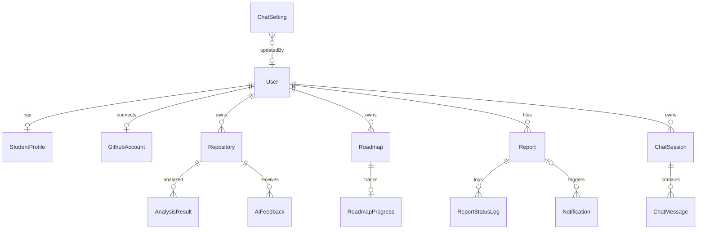
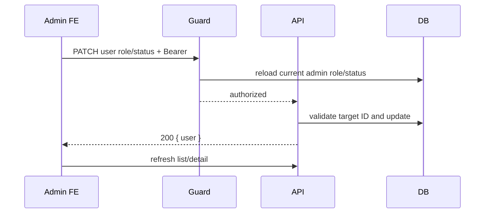
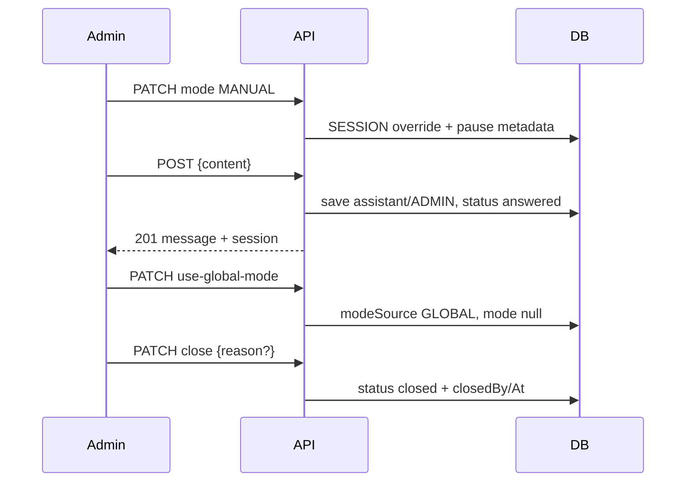

# WDP Career Roadmap API — Frontend Admin Integration

> Source audit: 2026-07-27. Tài liệu này dựa trên implementation trong `src/routes/admin.routes.js`, admin/auth middleware, controllers, services, models, serializers và tests; Swagger chỉ dùng để đối chiếu. User APIs xem `docs/FRONTEND_USER_API_INTEGRATION.md`.

## 1. Tổng quan Admin API

| Thuộc tính | Giá trị thực tế |
|---|---|
| Framework | Node.js, Express 4, Mongoose 8, MongoDB, Socket.IO |
| Production base URL | `https://career-roadmap-api-zs7y.onrender.com` |
| API prefix | `/api` |
| Admin prefix | `/api/admin` |
| Authentication | JWT Bearer |
| Authorization | `authMiddleware` rồi `adminMiddleware` ở router level |
| ID | MongoDB ObjectId, chuỗi 24 hex |
| Date/time | ISO-8601 khi JSON serialize `Date` |
| Pagination phổ biến | `page=1`, `limit=20`, limit 1–100 |

Header:

```http
Authorization: Bearer <token>
```

Wrapper chuẩn:

```ts
export interface AdminApiSuccess<T> {
  success: true;
  message: string;
  data: T;
  errorCode: null;
}

export interface AdminApiError {
  success: false;
  message: string;
  data: null;
  errorCode: string | null;
  errors: unknown[];
}
```

| Quyền | Điều kiện | Middleware | Kết quả không đủ quyền |
|---|---|---|---|
| Chưa đăng nhập | thiếu/sai/hết hạn/revoked JWT | `authMiddleware` | 401 |
| Đăng nhập, không phải admin | role DB khác `admin` | `adminMiddleware` | 403 `Admin permission is required` |
| Admin inactive/banned | status DB khác `active` | `adminMiddleware` | 403 `Account is not active` |
| Admin hợp lệ | JWT hợp lệ, User tồn tại, role admin, status active | cả hai | controller chạy |
| User trong token không còn | không tìm thấy User DB | `adminMiddleware` | 404 `User not found` |
| Resource không tồn tại/ID sai | service lookup | service | 404 resource-specific |

## 2. Admin authentication và authorization

Không có admin login riêng. Admin đăng nhập qua `POST /api/auth/login` như user; response local login chứa JWT ở `data.token`. JWT payload có `role`, nhưng admin guard **không tin role trong token**: mỗi Admin request query `User.findById(...).select("role status")`.

Hệ quả:

- Đổi admin xuống role khác: token cũ lập tức nhận 403 ở Admin API kế tiếp.
- Đổi status thành inactive/banned: token cũ lập tức nhận 403 ở Admin API.
- Đổi user thành admin: JWT cũ vẫn có thể vào Admin API vì guard đọc role DB, miễn payload có userId hợp lệ.
- User-facing routes chỉ dùng auth middleware có thể vẫn hoạt động khi status inactive/banned; Admin routes thì bị chặn.
- Logout ghi JWT vào `RevokedToken`, lần sau trả 401.

Không có self-protection trong update role/status, không có last-admin protection và không có audit log cho hai mutation này.

## 3. Error handling và status codes

Admin router dùng error middleware chung. Query filter không hợp lệ thường bị **bỏ qua**, không trả validation error. `page`/`limit` âm, zero, NaN được clamp/default thay vì 400.

| Status | Trường hợp Admin API |
|---:|---|
| 200 | GET/PATCH/close thành công; close lặp lại cũng 200 |
| 201 | Admin manual chat message |
| 400 | Role/status/mode sai, report status sai, content thiếu, chat closed |
| 401 | Bearer/JWT thiếu, sai, hết hạn, revoked |
| 403 | Role không phải admin hoặc status không active |
| 404 | User trong guard hoặc resource/ObjectId không tồn tại |
| 500 | DB/filesystem/runtime error không được phân loại |

Chat closed có `errorCode: "CHAT_SESSION_CLOSED"`. Các validation/service error khác thường có `errorCode: "REQUEST_ERROR"`.

## 4. Admin enums

| Enum | Giá trị | File | API |
|---|---|---|---|
| User role | `student`, `mentor`, `counselor`, `admin` | `src/utils/constants.js`, `User.js` | users |
| User status | `active`, `inactive`, `banned` | `User.js` | guard/users |
| Repository visibility | model dùng `private: boolean`; không có enum/status | `Repository.js` | repositories |
| Analysis status | Không có enum/status lưu trong `AnalysisResult` | — | analysis |
| AI feedback status | Không có status enum | — | ai-feedback |
| Roadmap status | `active`, `archived` | `Roadmap.js` | roadmaps |
| Report status | `PENDING`, `IN_REVIEW`, `RESOLVED`, `REJECTED` | `Report.js` | reports |
| Report type | `user`, `repository`, `analysis`, `ai_feedback`, `roadmap`, `other` | `Report.js` | reports |
| Global/session chat mode | `AI_AUTO`, `MANUAL` | `ChatSetting.js`, `ChatSession.js` | chat |
| Chat mode source | `GLOBAL`, `SESSION` | `ChatSession.js` | chat |
| Chat status | `active`, `waiting_admin`, `answered`, `closed` | `ChatSession.js` | chat |
| Message role | `user`, `assistant`, `system` | `ChatMessage.js` | chat |
| Sender type | `USER`, `AI`, `ADMIN` | `ChatMessage.js` | chat |
| Dev2Vec artifact status | `ready`, `partial`, `unavailable` | computed in `dev2vecStatus.service.js` | dev2vec |

Không có hybrid chat mode, repository/analysis/feedback status hoặc Dev2Vec “model loaded” boolean riêng.

## 5. Admin data model



| Entity | Admin-visible | Bị loại/không trả | Lifecycle |
|---|---|---|---|
| `User` | account fields, role, status, settings, provider metadata | `password` select false và explicit `-password` | không có soft-delete field trong schema dù list query kiểm `isDeleted` |
| `StudentProfile` | Không được admin endpoints hiện tại populate | password/token không liên quan | one per user |
| `GithubAccount` | Detail repo chỉ username/display/avatar/profile/connectedAt | `accessToken`, tokenType/scope/email không populate | account can disconnect |
| `Repository` | full stored repository record + populated owner/account summary | account token; nhưng `rawData` repository vẫn được trả | DB cache; không soft-delete/status |
| `AnalysisResult` | analysis fields, sanitized Dev2Vec metadata | `rawAnalysis`, `skillEvidence`; fingerprint chỉ preview 12 chars | many per repo |
| `AiFeedback` | toàn record + compatibility mapper | `rawAiResponse` **không bị loại** | many per repo |
| `Roadmap` | compact roadmap, owner/repository, progress; detail thêm learningProgress | soft-deleted hidden unless includeDeleted | active/archived + soft-delete |
| `Report` | report, populated reporter/resolver; detail logs | không có attachment/target relation expansion | status transitions logged |
| `ChatSession` | full serialized state, admin relations | không có credentials | close is permanent in current API |
| `ChatMessage` | role/sender/content/metadata/timestamps | metadata có thể chứa AI provider/model/context | append-only |
| `ChatSetting` | derived mode flags, updater, updatedAt | raw Mongo ID không trả | GET creates default if absent |
| `Dev2VecStatus` | artifact booleans/metadata/versions/transport | artifact directory/path không trả | filesystem/config snapshot |

## 6. Quy ước list APIs

Không có `offset`, cursor, `sortBy`, `sortOrder`, `from`, `to` hoặc date filter trong Admin services.

| Group | Pagination | Search | Filter | Sort |
|---|---|---|---|---|
| Users | page/limit 20, max 100 | email/fullName/name | valid role/status; invalid ignored | createdAt desc |
| Repositories | same | name/fullName/language | không có user/visibility/status/language riêng | updatedAt desc |
| Analysis | same | repoName/fullName/projectType/careerDirection | không có user/repo/status/date filter | analyzedAt, createdAt desc |
| AI feedback | same | repoName/fullName/summary/careerDirection | không có user/repo/status/model/date filter | generatedAt, createdAt desc |
| Roadmaps | same | targetRole/currentGithubDirection/summary | status, includeDeleted | updatedAt desc |
| Reports | same | không có | status, type hoặc targetType | createdAt desc |
| Chat | same | không có | status/mode/modeSource/userId/assignedAdminId | lastMessageAt, updatedAt desc |

Invalid enum/ObjectId filters are ignored. Empty list luôn `{items:[],pagination:{...,total:0,totalPages:0}}`.

## 7. Admin Dashboard

`GET /api/admin/dashboard` không nhận query, không cache và chạy nhiều `countDocuments` song song/cục bộ.

```ts
export interface AdminDashboard {
  users: { total: number; active: number; banned: number };
  github: { repositories: number };
  analysis: {
    total: number;
    currentCompatible: number;
    legacyOrIncompatible: number;
    currentSnapshots: number;
    legacySnapshots: number;
  };
  aiFeedback: { total: number };
  roadmaps: { active: number };
  reports: { pending: number };
}
```

Không có inactive count, role breakdown, connected account count, chat count, time series, growth, recent activity hoặc timezone/range. FE nên render cards/status breakdown; không có dữ liệu chart thời gian.

## 8. User management

### List/detail

List trả raw lean User trừ password. Không join profile, GitHub, repository/roadmap counts. Detail cũng chỉ `{user}`; không chứa related entities/reports/chat.

### Update role/status

```json
{"role":"admin"}
```

```json
{"status":"banned"}
```

Role/status update dùng `findByIdAndUpdate`, trả `{user}` không password. Không cấm self-change, không bảo vệ admin cuối cùng, không revoke JWT, không notification/audit. Admin guard đọc DB làm Admin API quyền thay đổi ngay; user routes không kiểm status.



Không optimistic update; hiển thị confirm đặc biệt khi target ID trùng current admin.

## 9. GitHub repository management

Hai endpoint chỉ đọc MongoDB, không gọi GitHub và không sync.

- List search name/fullName/language; populate owner `fullName,name,email,role,status`.
- Detail trả toàn repository, populate owner và GithubAccount safe subset.
- `repoId` là Mongo ObjectId.
- Không có filter user/visibility/private/status/language riêng.
- Không có commit/package count/latest analysis join.
- Admin thấy metadata private repo đã cache và `rawData`; không nhận GitHub access token.
- Repository bị xóa/mất quyền trên GitHub không được endpoint xác minh.

## 10. Analysis management

`analysisId` là `_id` của `AnalysisResult` (collection cấu hình `analysissnapshots`), không phải `RepoAnalysisSnapshot` ID. List/detail chỉ DB, populate user/repository.

Sanitizer:

- loại `rawAnalysis` và `skillEvidence`;
- giữ strengths, weaknesses, missingSkills, recommendations, scores, checklist, commit/user-contribution summaries và `skillVector`;
- thu gọn Dev2Vec thành modelVersion, scoringMethod, predictions, gaps, vectorSources, sourceStats, cache version metadata;
- fingerprint chỉ trả 12 ký tự preview;
- thêm `modelVersion`, `pipelineVersion`, `isCompatible`.

Không có latest marker, status/error/duration fields chuẩn hóa hoặc pagination nested arrays. Filter Swagger/search đúng; user/repository/status/date filter không tồn tại.

## 11. AI feedback management

List/detail chỉ đọc DB, không gọi Gemini. Populates user, repository, `analysisSnapshotId`; sau đó compatibility evaluation/build response có thể query compatible context DB.

Model có summary, feedback arrays, advice, promptVersion, generatedAt, metadata và `rawAiResponse`. Admin service spread raw record và **không sanitize `rawAiResponse`**. Không có status, failed-record model, token usage/duration enum hay date/model filter. Invalid AI output chỉ có thể phản ánh trong stored raw/metadata; không có contract failed state.

## 12. Roadmap management

### List/detail

List filters `search,status,includeDeleted`; attaches owner/repository/snapshot provenance and progress summary. Detail additionally returns normalized task-level `learningProgress`:

- `currentTask`
- `recentlyCompleted`
- `nextRecommendedTask`
- `completedTasks`
- `inProgressTasks`
- `pendingTasks`
- `orphanProgressItems`
- `items`

Không embed LearningContent, course recommendations, status history hoặc AI credential/prompt. `roadmapSource`, role match và generation content là dynamic.

### Status update

Body `{status:"active"|"archived"}`. Không có transition rules, notification/audit hoặc side effect lên progress/content. Soft-deleted roadmap không update được. Archived roadmap vẫn có thể được user lấy nếu user detail service không chặn status; “archive” không đồng nghĩa soft-delete. Admin status update và user archive cùng thay `status`.

## 13. Report management

List filter status/type, không search/reporter/date/target expansion. Detail trả `{report,statusLogs}`; log mới nhất trước và populate `changedBy`.

PATCH:

```json
{"status":"RESOLVED","adminNote":"Đã xử lý nội dung được báo cáo."}
```

Chỉ nhận `IN_REVIEW`, `RESOLVED`, `REJECTED`; legacy lowercase/reviewing được normalize. `adminNote` optional, không có required resolution note. Không enforce transition graph; cùng status có thể update/lập log lại. RESOLVED/REJECTED set resolver/time; IN_REVIEW clears them. Mỗi update ghi `ReportStatusLog` và tạo notification bắt buộc cho reporter; không thay đổi reported resource. Model không có attachments.

## 14. Admin Chat Management

### Effective mode

| Global setting | Session modeSource/mode | Effective mode |
|---|---|---|
| AI_AUTO | GLOBAL / mode serialized null | AI_AUTO |
| MANUAL | GLOBAL / null | MANUAL |
| bất kỳ | SESSION / AI_AUTO | AI_AUTO |
| bất kỳ | SESSION / MANUAL | MANUAL |

Session override ưu tiên global. Serializer trả `mode:null` khi `modeSource=GLOBAL`, dù Mongo default có mode.

### List/detail

List có filters đã nêu, pagination và populated user/admin. `lastMessage` trong list là **message object mới nhất**, ghi đè field session string cùng tên. Không có search/unanswered/date/message count/followGlobal boolean; dùng `modeSource === "GLOBAL"`. Detail trả session + tất cả messages tăng dần, không pagination; không populate repository/analysis/roadmap objects, chỉ IDs.

### Global settings

GET gọi `getOrCreateChatSetting`: nếu chưa có record thì GET tạo default AI_AUTO. Response:

```ts
interface AdminChatSettings {
  mode: "AI_AUTO" | "MANUAL";
  aiEnabled: boolean;
  manualEnabled: boolean;
  updatedBy: { id:string; email:string; fullName:string } | null;
  updatedAt: string | null;
}
```

PATCH chỉ nhận `{mode}`; không có maintenance message, auto-response, business hours. Khi chuyển global sang AI_AUTO, mọi open GLOBAL session đang waiting_admin được đổi active. SESSION overrides không đổi. Socket.IO emit update cho mọi open GLOBAL session.

### Override/use-global/close/manual reply

- Override `{mode,reason?}` sets modeSource SESSION. MANUAL sets assignedAdmin/aiPaused fields; AI_AUTO clears chúng và converts waiting_admin→active.
- Use-global không nhận body; sets `modeSource=GLOBAL`, `mode=null`, nhưng **không clear** assignedAdmin/aiPaused/manualReason.
- Manual reply `{content}` không yêu cầu effective MANUAL và không tự đổi mode. Nó creates assistant/ADMIN message, status answered, assigned admin, unread user, emits realtime. Không gọi AI.
- Closed session chặn reply và mode changes bằng 400 `CHAT_SESSION_CLOSED`.
- Close body `{reason?}`, set status/closed fields, emits realtime; repeat close is idempotent 200. Không có reopen endpoint/notification.
- Không có lock/in-flight marker để ngăn admin reply đồng thời với AI request.

```mermaid
sequenceDiagram
  participant U as User
  participant API
  participant AI
  participant DB
  U->>API: POST message
  API->>DB: resolve global/session mode
  alt effective AI_AUTO
    API->>DB: save USER message
    API->>AI: generate with context
    AI-->>API: answer
    API->>DB: save AI assistant; status active
  else effective MANUAL
    API->>DB: save USER message; status waiting_admin
  end
  API-->>U: non-streaming response + Socket.IO events
```



## 15. Dev2Vec status

Endpoint đọc filesystem artifact presence, JSON metadata và environment; không chạy inference/training và không gọi worker health live.

```ts
export interface AdminDev2VecStatus {
  status: "ready"|"partial"|"unavailable";
  modelVersion: string|null;
  trainedAt: string|null;
  roles: string[];
  roleIds: string[];
  vectorDims: { repo:number; issue:number; api:number; combined:number };
  dataset: { sampleCount:number; samplesPerRole: Record<string,number> };
  artifacts: {
    doc2vecRepo:boolean; doc2vecIssue:boolean; doc2vecApi:boolean;
    classifier:boolean; labelEncoder:boolean; skillVectors:boolean;
    skillPrototypes:boolean; metadata:boolean; manifest:boolean;
  };
  enabled: boolean;
  pipelineVersion: string;
  mappingVersion: string;
  cachePolicyVersion: string;
  transportMode: "http_worker"|"process";
}
```

Không trả last load time, device/runtime, live endpoint, error text, prototypes content hoặc filesystem path.

## 16. API Reference

Mọi endpoint dưới đây cần JWT + admin role/status active; middleware: `authMiddleware`, `adminMiddleware`. Success dùng wrapper chuẩn.

### Dashboard/Dev2Vec

| Endpoint | Query/body | Success | Errors/side effects/FE |
|---|---|---|---|
| `GET /api/admin/dashboard` | none | 200 AdminDashboard | DB aggregate; loading cards; retry GET |
| `GET /api/admin/dev2vec/status` | none | 200 AdminDev2VecStatus | filesystem/config read; retry GET |

### Users

| Endpoint | Query/body/path | Success | Errors/security/FE |
|---|---|---|---|
| `GET /api/admin/users` | page,limit,search,role,status | 200 paginated raw-safe users | invalid filters ignored; debounce search |
| `GET /api/admin/users/:userId` | ObjectId | 200 `{user}` | 404; no relations |
| `PATCH /api/admin/users/:userId/role` | `{role}` | 200 `{user}` | 400/404; no self/last-admin protection; confirm+refetch |
| `PATCH /api/admin/users/:userId/status` | `{status}` | 200 `{user}` | 400/404; self-lock possible; confirm+refetch |

### Repositories/analysis/feedback

| Endpoint | Inputs | Success | Source/notes |
|---|---|---|---|
| `GET /api/admin/github/repositories` | page,limit,search | paginated repositories | DB only |
| `GET /api/admin/github/repositories/:repoId` | ObjectId | `{repository}` | DB, owner/account populate |
| `GET /api/admin/analysis` | page,limit,search | sanitized paginated analyses | DB |
| `GET /api/admin/analysis/:analysisId` | AnalysisResult ObjectId | `{analysis}` | raw analysis/evidence removed |
| `GET /api/admin/ai-feedback` | page,limit,search | paginated feedback | DB/compatibility queries |
| `GET /api/admin/ai-feedback/:feedbackId` | ObjectId | `{feedback}` | rawAiResponse currently visible |

### Roadmaps/reports

| Endpoint | Inputs | Success | Mutation/FE |
|---|---|---|---|
| `GET /api/admin/roadmaps` | page,limit,search,status,includeDeleted | list + progress | DB |
| `GET /api/admin/roadmaps/:roadmapId` | `includeDeleted?` | detail + learningProgress | DB |
| `PATCH /api/admin/roadmaps/:roadmapId/status` | active/archived | `{roadmap}` | confirm/refetch; no optimistic |
| `GET /api/admin/reports` | page,limit,status,type/targetType | paginated reports | DB |
| `GET /api/admin/reports/:reportId` | ObjectId | report + logs | DB |
| `PATCH /api/admin/reports/:reportId/status` | status,adminNote? | `{report}` | log + user notification; no blind retry |

### Chat

| Endpoint | Inputs | Success | Mutation/notes |
|---|---|---|---|
| `GET /api/admin/chat/settings` | none | setting | may create default record |
| `PATCH /api/admin/chat/settings` | `{mode}` | setting | affects GLOBAL sessions immediately |
| `GET /api/admin/chat/sessions` | page/limit/status/mode/modeSource/userId/assignedAdminId | paginated list | DB + setting |
| `GET /api/admin/chat/sessions/:sessionId` | ObjectId | session + all messages | no nested pagination |
| `POST .../:sessionId/messages` | `{content}` | 201 adminMessage/session | works in either mode; not closed |
| `PATCH .../:sessionId/mode` | `{mode,reason?}` | session | SESSION override |
| `PATCH .../:sessionId/use-global-mode` | no body | session | follows global |
| `PATCH .../:sessionId/close` | `{reason?}` | session | idempotent close, no reopen |

### Request/response examples

Path-template mapping dùng trong OpenAPI/FE router (tương đương các route Express `:param` ở trên):

```text
GET   /api/admin/users/{userId}
PATCH /api/admin/users/{userId}/role
PATCH /api/admin/users/{userId}/status
GET   /api/admin/github/repositories/{repoId}
GET   /api/admin/analysis/{analysisId}
GET   /api/admin/ai-feedback/{feedbackId}
GET   /api/admin/roadmaps/{roadmapId}
PATCH /api/admin/roadmaps/{roadmapId}/status
GET   /api/admin/reports/{reportId}
PATCH /api/admin/reports/{reportId}/status
GET   /api/admin/chat/sessions/{sessionId}
POST  /api/admin/chat/sessions/{sessionId}/messages
PATCH /api/admin/chat/sessions/{sessionId}/mode
PATCH /api/admin/chat/sessions/{sessionId}/use-global-mode
PATCH /api/admin/chat/sessions/{sessionId}/close
```

```json
{"mode":"MANUAL","reason":"Cần tư vấn thủ công"}
```

```json
{"content":"Mình đã kiểm tra lộ trình và đề xuất ưu tiên phần testing."}
```

```json
{
  "success": true,
  "message": "Admin message sent successfully",
  "data": {
    "adminMessage": {
      "_id": "665f1f000000000000000010",
      "sessionId": "665f1f000000000000000001",
      "userId": "665f1f000000000000000003",
      "role": "assistant",
      "senderType": "ADMIN",
      "senderId": "665f1f000000000000000002",
      "content": "Mình đã kiểm tra lộ trình và đề xuất ưu tiên phần testing."
    },
    "session": {"status":"answered","modeSource":"SESSION","effectiveMode":"MANUAL"}
  },
  "errorCode": null
}
```

Fields không xuất hiện trong ví dụ có thể vẫn được serializer trả; dùng types dưới đây.

## 17. TypeScript types cho Admin Frontend

```ts
export type ObjectId = string;
export type ISODate = string;
export type AdminRole = "student"|"mentor"|"counselor"|"admin";
export type UserStatus = "active"|"inactive"|"banned";
export type ChatMode = "AI_AUTO"|"MANUAL";
export type ChatModeSource = "GLOBAL"|"SESSION";
export type ChatStatus = "active"|"waiting_admin"|"answered"|"closed";

export interface AdminPaginatedResponse<T> {
  items: T[];
  pagination: { page:number; limit:number; total:number; totalPages:number };
}
export interface AdminApiError {
  success:false; message:string; data:null;
  errorCode:string|null; errors:unknown[];
}
export interface AdminDashboardMetric { [key:string]: number }
export interface AdminDashboard {
  users:{total:number;active:number;banned:number};
  github:{repositories:number};
  analysis:{total:number;currentCompatible:number;legacyOrIncompatible:number;currentSnapshots:number;legacySnapshots:number};
  aiFeedback:{total:number}; roadmaps:{active:number}; reports:{pending:number};
}
export interface AdminUserListItem {
  _id:ObjectId; fullName:string; name?:string; avatarUrl:string; avatar:string;
  email?:string; provider:"local"|"google"|"github"; role:AdminRole;
  status:UserStatus; settings:unknown; createdAt:ISODate; updatedAt:ISODate;
}
export type AdminUserDetail = AdminUserListItem;
export interface AdminUpdateUserRoleRequest { role:AdminRole }
export interface AdminUpdateUserStatusRequest { status:UserStatus }

export interface AdminRelationUser {
  _id?:ObjectId; id?:ObjectId; fullName?:string; name?:string;
  email:string; role:AdminRole; status?:UserStatus;
}
export interface AdminRepositoryListItem {
  _id:ObjectId; userId:AdminRelationUser; githubAccountId:ObjectId|null;
  githubRepoId:number; name:string; fullName:string; description:string;
  htmlUrl:string; private:boolean; fork:boolean; language:string; topics:string[];
  defaultBranch:string; lastSyncedAt:ISODate; rawData:unknown;
  createdAt:ISODate; updatedAt:ISODate;
}
export interface AdminRepositoryDetail extends Omit<AdminRepositoryListItem,"githubAccountId"> {
  githubAccountId:{
    _id:ObjectId; username:string; displayName:string; avatarUrl:string;
    profileUrl:string; connectedAt:ISODate;
  }|null;
}
export interface AdminAnalysisListItem {
  _id:ObjectId; userId:AdminRelationUser; repositoryId:unknown;
  repoName:string; fullName:string; analyzedAt:ISODate; projectType:string;
  languages:string[]; frameworks:string[]; packages:string[]; configs:string[];
  strengths:string[]; weaknesses:string[]; missingSkills:string[];
  recommendations:string[]; scores:Record<string,number>; summary:unknown;
  skillVector:unknown[]; dev2vec:unknown;
  modelVersion:string|null; pipelineVersion:string|null; isCompatible:boolean;
}
export type AdminAnalysisDetail = AdminAnalysisListItem;
export interface AdminAiFeedbackListItem {
  _id:ObjectId; userId:AdminRelationUser; repositoryId:unknown;
  analysisSnapshotId:unknown|null; summary:string; strengthFeedback:string[];
  weaknessFeedback:string[]; learningAdvice:string; nextSteps:string[];
  recommendedTopics:string[]; careerSuggestion:string; portfolioAdvice:string;
  riskNotes:string[]; rawAiResponse:unknown; metadata:unknown;
  promptVersion:string; generatedAt:ISODate; [key:string]:unknown;
}
export type AdminAiFeedbackDetail = AdminAiFeedbackListItem;

export interface AdminProgressSummary {
  totalItems:number; completedItems:number; inProgressItems:number;
  pendingItems:number; overallProgress:number;
}
export interface AdminRoadmapListItem {
  roadmapId:ObjectId; targetRole:string; roleId:string; requestedLevel:string;
  effectiveLevel:string; durationWeeks:number; language:string;
  mainRoadmap:unknown; alternativeRoadmaps:unknown[]; roadmapSource:unknown;
  status:"active"|"archived"; isDeleted:boolean; deletedAt:ISODate|null;
  deletedBy:ObjectId|null; user:unknown|null; repository:unknown|null;
  progressSummary:AdminProgressSummary; createdAt:ISODate; updatedAt:ISODate;
}
export interface AdminRoadmapDetail extends AdminRoadmapListItem {
  learningProgress:{
    currentTask:unknown|null; recentlyCompleted:unknown[];
    nextRecommendedTask:unknown|null; completedTasks:unknown[];
    inProgressTasks:unknown[]; pendingTasks:unknown[];
    orphanProgressItems:unknown[]; items:unknown[];
  };
}
export interface AdminUpdateRoadmapStatusRequest { status:"active"|"archived" }

export interface AdminReportListItem {
  _id:ObjectId; userId:AdminRelationUser; type:"user"|"repository"|"analysis"|"ai_feedback"|"roadmap"|"other";
  targetId:ObjectId|null; reason:string; description:string;
  status:"PENDING"|"IN_REVIEW"|"RESOLVED"|"REJECTED";
  adminNote:string; resolvedBy:AdminRelationUser|null; resolvedAt:ISODate|null;
  createdAt:ISODate; updatedAt:ISODate;
}
export interface AdminReportDetail extends AdminReportListItem {}
export interface AdminReportStatusLog {
  _id:ObjectId; changedBy:AdminRelationUser;
  fromStatus:"PENDING"|"IN_REVIEW"|"RESOLVED"|"REJECTED"|null;
  toStatus:"PENDING"|"IN_REVIEW"|"RESOLVED"|"REJECTED";
  adminNote:string; createdAt:ISODate;
}
export interface AdminUpdateReportStatusRequest {
  status:"IN_REVIEW"|"RESOLVED"|"REJECTED"; adminNote?:string;
}

export interface AdminChatMessage {
  _id:ObjectId; sessionId:ObjectId; userId:ObjectId;
  role:"user"|"assistant"|"system"; senderType:"USER"|"AI"|"ADMIN";
  senderId:ObjectId|null; content:string; metadata:unknown;
  createdAt:ISODate; updatedAt:ISODate;
}
export interface AdminChatSessionListItem {
  _id:ObjectId; userId:AdminRelationUser; user:AdminRelationUser;
  repositoryId:ObjectId|null; roadmapId:ObjectId|null; analysisId:ObjectId|null; snapshotId:ObjectId|null;
  title:string; lastMessage:AdminChatMessage|null; status:ChatStatus;
  mode:ChatMode|null; modeSource:ChatModeSource; effectiveMode:ChatMode;
  assignedAdminId:AdminRelationUser|null; aiPausedAt:ISODate|null;
  manualReason:string; unreadByAdmin:boolean; unreadByUser:boolean;
  lastMessageAt:ISODate|null; lastResponseAt:ISODate|null;
  closedAt:ISODate|null; closedBy:ObjectId|AdminRelationUser|null;
  closeReason:string; createdAt:ISODate; updatedAt:ISODate;
}
export interface AdminChatSessionDetail extends Omit<AdminChatSessionListItem,"lastMessage"> {}
export interface AdminChatSettings {
  mode:ChatMode; aiEnabled:boolean; manualEnabled:boolean;
  updatedBy:{id:ObjectId;email:string;fullName:string}|null; updatedAt:ISODate|null;
}
export interface AdminUpdateChatSettingsRequest { mode:ChatMode }
export interface AdminUpdateChatModeRequest { mode:ChatMode; reason?:string }
export interface AdminManualChatMessageRequest { content:string }
export interface AdminDev2VecStatus {
  status:"ready"|"partial"|"unavailable"; modelVersion:string|null; trainedAt:ISODate|null;
  roles:string[]; roleIds:string[]; vectorDims:{repo:number;issue:number;api:number;combined:number};
  dataset:{sampleCount:number;samplesPerRole:Record<string,number>};
  artifacts:Record<string,boolean>; enabled:boolean; pipelineVersion:string;
  mappingVersion:string; cachePolicyVersion:string; transportMode:"http_worker"|"process";
}
```

## 18. Bảng tổng hợp Admin APIs

| Nhóm | Method | Endpoint | Auth | Filters | Mutation | Nguồn |
|---|---|---|---|---|---|---|
| Dashboard | GET | `/dashboard` | Admin | none | no | DB aggregate |
| Users | GET/PATCH | `/users*` | Admin | page/search/role/status | role/status | Database |
| Repositories | GET | `/github/repositories*` | Admin | page/search | no | Database |
| Analysis | GET | `/analysis*` | Admin | page/search | no | Database |
| Feedback | GET | `/ai-feedback*` | Admin | page/search | no | Database |
| Roadmaps | GET/PATCH | `/roadmaps*` | Admin | page/search/status/deleted | status | Database aggregate |
| Reports | GET/PATCH | `/reports*` | Admin | page/status/type | status/log/notify | Database |
| Chat | GET/POST/PATCH | `/chat*` | Admin | chat filters/page | settings/message/mode/close | Chat DB/runtime |
| Dev2Vec | GET | `/dev2vec/status` | Admin | none | no | filesystem/config runtime |

Prefix every path in this table with `/api/admin`.

## 19. Ma trận quyền và mutation

| Hành động | Role | Có thể tự tác động | Side effect | FE confirm |
|---|---|---:|---|---:|
| View all data | admin active | n/a | none | no |
| Update role | admin active | yes | immediate Admin guard effect | yes |
| Update status | admin active | yes | immediate Admin guard effect | yes |
| Update roadmap status | admin active | n/a | DB status | yes |
| Update report | admin active | n/a | log + user notification | yes |
| Global chat mode | admin active | n/a | all open GLOBAL sessions + realtime | yes |
| Session override/global | admin active | n/a | mode/pause metadata + realtime | yes |
| Manual reply | admin active | n/a | message/status/unread + realtime | no/optional |
| Close session | admin active | n/a | permanent closed state + realtime | yes |

## 20. Edge cases

- Expired/revoked token: 401.
- Admin demoted/inactive/banned while token lives: next Admin request 403.
- Self-demotion/self-ban and removing last admin are allowed.
- Invalid pagination clamps/defaults; invalid filters/sort fields are ignored because sort fields are not accepted.
- Resource removed between list/detail: 404.
- Roadmap user-soft-deleted hidden unless includeDeleted; PATCH cannot update it.
- Report target may no longer exist; detail does not resolve target.
- Report transition is unrestricted among non-PENDING targets and duplicate transition logs again.
- Closed chat blocks replies/mode changes; repeated close returns 200.
- Global mode change applies immediately to GLOBAL sessions; override remains.
- Admin reply may race an already-running AI response; no lock/version check.
- User banned during chat: admin can still inspect/reply; user Admin guard is irrelevant.
- Dev2Vec missing/disabled returns 200 with unavailable/partial unless filesystem operation throws.
- DB aggregate failure returns 500.

## 21. Potential backend issues

| Severity | Vấn đề | File | Behavior | Rủi ro | Đề xuất |
|---|---|---|---|---|---|
| Critical | Self/last-admin protection thiếu | `admin.service.js` | admin tự demote/ban, xóa quyền admin cuối | lockout hệ thống | forbid self destructive + transaction/count |
| High | Raw AI output exposed | `admin.service.js:getAiFeedback*` | spreads `rawAiResponse` | prompt/data leakage | explicit admin DTO/redaction |
| High | Repository rawData exposed | repository admin responses | raw GitHub payload returned | excessive/private metadata | safe serializer |
| High | AI/admin reply race | `chat.service.js` | no in-flight/optimistic lock | double/conflicting response | request state/version lock |
| Medium | use-global leaves pause/admin metadata | `chat.service.js` | only modeSource/mode/status reset | misleading UI/state | clear override metadata |
| Medium | Manual reply allowed in AI mode | `sendAdminChatMessage` | no effective-mode requirement | human + AI collision | require MANUAL or atomic takeover |
| Medium | GET settings writes DB | `getOrCreateChatSetting` | GET creates default | unexpected mutation/race duplicates | seed/upsert singleton |
| Medium | Chat detail unbounded messages | `getAdminChatSessionDetail` | all messages | large payload | cursor pagination |
| Medium | Filters advertised beyond code expectations | Swagger/descriptions | several requested filters absent/invalid ignored | misleading FE | validate/query DTO/OpenAPI |
| Medium | No audit for user/roadmap mutations | `admin.service.js` | direct update | poor accountability | audit collection |
| Medium | Dashboard many counts | `getDashboard` | multiple uncached queries; some sequential awaits | scale latency | aggregate/cache/index |
| Low | List raw model shapes | generic `buildListResult` | inconsistent IDs/fields | FE coupling | response mappers |
| Low | GET repo no live deletion check | admin repository service | DB only | stale state | expose freshness, optional safe refresh |
| Low | Error/query behavior inconsistent | middleware/services | invalid filters ignored; body invalid throws | UX ambiguity | centralized validation |

## 22. Checklist Admin Frontend

### Access

- [ ] Shared login → store JWT → `/api/auth/me`
- [ ] Require role `admin`, but still handle server 403
- [ ] Clear auth on 401; show access-lost on 403
- [ ] Prevent current-admin self role/status mutation in UI

### Dashboard/data

- [ ] Render only available count cards
- [ ] Paginated users/repositories/analysis/feedback
- [ ] Debounced supported search only
- [ ] Safe viewers for dynamic analysis/raw feedback
- [ ] Dev2Vec artifact status

### Roadmaps/reports

- [ ] includeDeleted toggle and deleted detail query
- [ ] Confirm roadmap status
- [ ] Report detail + logs
- [ ] Confirm report transition; refresh notifications/list

### Chat

- [ ] Global setting and realtime refresh
- [ ] Session filters/pagination/detail
- [ ] Explicit takeover to MANUAL before manual reply
- [ ] SESSION override/global state
- [ ] Closed state and idempotent close
- [ ] Disable actions during mutation; reconcile Socket.IO races

## 23. Admin API client recommendation

```ts
const BASE = "https://career-roadmap-api-zs7y.onrender.com/api/admin";

export function toQuery(input: Record<string, unknown>) {
  const q = new URLSearchParams();
  for (const [key, value] of Object.entries(input)) {
    if (value !== undefined && value !== null && value !== "") q.set(key, String(value));
  }
  return q.toString();
}

export async function adminApi<T>(
  path: string,
  token: string,
  init: RequestInit = {},
): Promise<T> {
  const response = await fetch(`${BASE}${path}`, {
    ...init,
    headers: {
      Accept: "application/json",
      ...(init.body ? {"Content-Type":"application/json"} : {}),
      Authorization: `Bearer ${token}`,
      ...init.headers,
    },
  });
  const body = await response.json().catch(() => ({}));
  if (!response.ok || body.success === false) {
    if (response.status === 401) clearAdminSession();
    if (response.status === 403) routeToAccessDenied();
    throw Object.assign(new Error(body.message || "Admin request failed"), {
      status: response.status, errorCode: body.errorCode ?? null, errors: body.errors ?? [],
    });
  }
  return body.data as T;
}
```

Use `AbortController` cho list/detail. Không optimistic update role/status/roadmap/report/chat mode; disable submit, confirm thao tác nguy hiểm, PATCH xong refetch detail/list. Không log whole repository, feedback raw output, messages hoặc response errors có metadata. Module đề xuất: `admin-client.ts`, `dashboard.api.ts`, `users.api.ts`, `repositories.api.ts`, `analysis.api.ts`, `ai-feedback.api.ts`, `roadmaps.api.ts`, `reports.api.ts`, `chat.api.ts`, `dev2vec.api.ts`.

## 24. Swagger/code audit và phần chưa chắc chắn

Code có 26 Admin operations và Swagger cũng có đủ 26; không phát hiện Swagger Admin path thiếu implementation hoặc Admin route thiếu Swagger. Toàn bộ routes được guard ở router level.

Swagger/comments drift hoặc thiếu chi tiết:

- User role description nói quyền đổi “after next authenticated request”; thực tế admin guard query DB ngay request kế tiếp, không cần login lại.
- Repository/analysis/feedback descriptions không thể hiện các filter mong muốn nhưng service cũng không hỗ trợ.
- Analysis Swagger nói “raw analysis data”; sanitizer thực tế loại `rawAnalysis`.
- AI feedback Swagger đúng rằng detail có raw response; đây là security concern.

> Chưa xác định chắc chắn từ code hiện tại: shape tĩnh đầy đủ của `rawData`, `rawAiResponse`, roadmap AI-generated `Mixed` fields và một số Dev2Vec prediction/gap objects; không có DTO đóng.

> Chưa xác định chắc chắn từ code hiện tại: behavior khi nhiều `ChatSetting` records cùng tồn tại; service dùng `findOne()` và không có singleton unique constraint.
