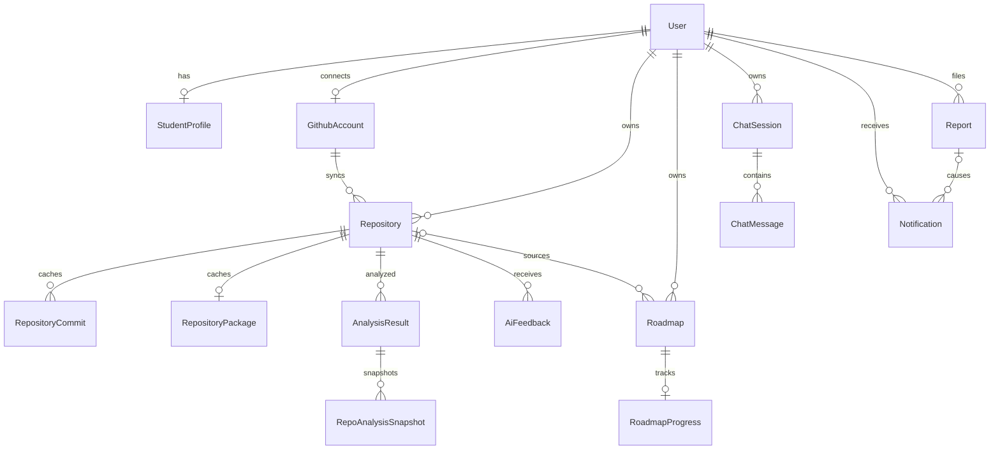
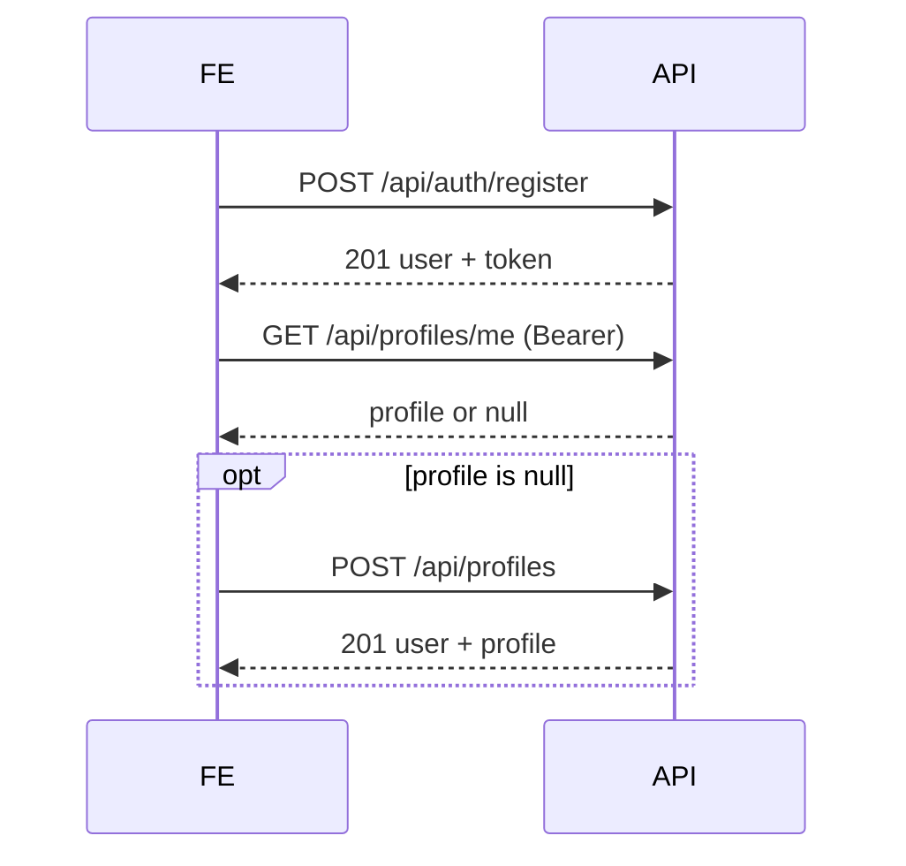
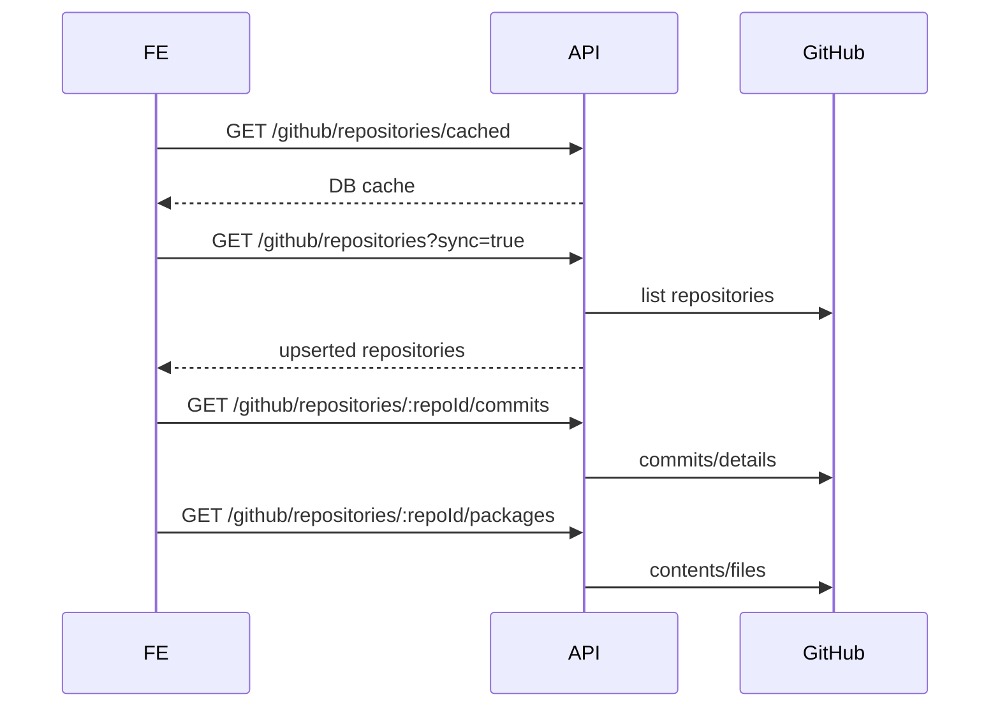
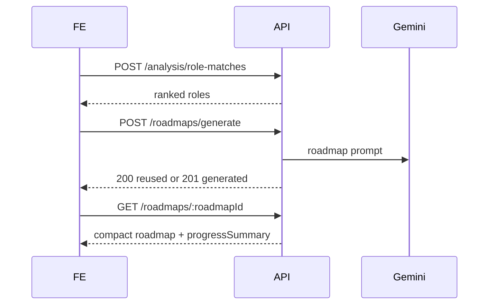

# WDP Career Roadmap API — Frontend User Integration

> Source-of-truth audit: 2026-07-27. Tài liệu này ưu tiên implementation trong `server.js`, `src/app.js`, routes, middleware, validators, controllers, services và Mongoose models. Swagger chỉ được dùng để đối chiếu. Phạm vi không mô tả chi tiết `/api/admin/*`; xem `docs/FRONTEND_ADMIN_API_INTEGRATION.md` khi cần luồng quản trị.

## 1. Tổng quan hệ thống

Backend là REST API cho đăng nhập, hồ sơ sinh viên, đồng bộ GitHub, phân tích repository, Dev2Vec role matching, AI feedback, roadmap, learning, progress, chat mentor, notification và report.

| Thuộc tính | Giá trị từ code |
|---|---|
| Framework | Node.js, Express 4, CommonJS, Mongoose 8, Socket.IO |
| Entry point | `server.js`; app tại `src/app.js` |
| Production base URL | `https://career-roadmap-api-zs7y.onrender.com` |
| API prefix | Phần lớn endpoint dùng `/api`; health còn có `/health`, `/live` |
| Content type | Request JSON qua `express.json()`; response chủ yếu JSON; OAuth callback là HTTP redirect |
| Database | MongoDB |
| ID | MongoDB ObjectId dạng chuỗi 24 hex cho ID nội bộ; `githubRepoId` là number; roadmap task dùng `itemId` string |
| Date/time | JSON ISO-8601 do Mongoose/`Date` serialize |
| Swagger | `/api/swagger` |

### CORS

Backend bật `credentials: true`. Origin được chấp nhận khi không có header `Origin`, hoặc nằm trong danh sách cấu hình frontend, `API_BASE_URL`, hay các localhost `3000`, `5173`, `5000`, `8081`. Origin khác sinh lỗi CORS; lỗi này có thể đi qua error middleware thành 500.

### Wrapper response

Wrapper chuẩn:

```ts
export interface ApiSuccess<T> {
  success: true;
  message: string;
  data: T;
  errorCode: null;
}

export interface ApiError {
  success: false;
  message: string;
  data: null;
  errorCode: string | null;
  errors: unknown[];
}
```

Không có wrapper thống nhất tuyệt đối:

- `POST /api/auth/google` trả `{ success, message, data }`, không có `errorCode`.
- `POST /api/auth/github` trả `{ success: true, authUrl }`, không có `message`, `data`, `errorCode`.
- OAuth callbacks trả redirect, không trả JSON.
- Course recommendation tự tạo `{ success, message, data }`.
- Một số lỗi controller Google trả `{ success:false,message,data:null }`.

Frontend phải đọc `success`, nhưng không giả định `errorCode`, `errors` hoặc `data` luôn tồn tại.

### Public endpoints và external services

Public: `/`, `/live`, `/health`, `/api/health`, register/login/social login và hai OAuth callbacks. Tất cả feature endpoint còn lại trong tài liệu cần JWT. External services: GitHub OAuth/API, Google tokeninfo, Gemini-compatible API, Python Dev2Vec (HTTP worker hoặc child process), YouTube API và Coursera seed offline.

## 2. Authentication và authorization

Gửi JWT:

```http
Authorization: Bearer <token>
```

`authMiddleware` verify bằng `JWT_SECRET`, kiểm tra chính chuỗi token trong `RevokedToken`, sau đó đặt payload vào `req.user` và token vào `req.token`. Payload được tạo với `id`, `userId`, `email`, `provider`, và với local login có thêm `role`; thư viện còn thêm `iat`, `exp`. Expiration lấy từ cấu hình trong `generateToken`; không có refresh token/refresh endpoint.

Local register/login trả JWT ở `data.token`. Google login và GitHub login trả ở `data.accessToken` hoặc URL fragment `#accessToken=...`. FE nên chuẩn hóa cả hai thành một access token nội bộ.

Middleware không đọc lại `User.status`; user `inactive`/`banned` vẫn qua JWT middleware. Role chỉ được kiểm tra ở admin middleware, không áp dụng cho user routes. Logout upsert token hiện tại vào blacklist đến `exp`; đây là revoke thật, không chỉ là hướng dẫn FE xóa token.

| Trạng thái | Ý nghĩa thực tế | Cách FE xử lý |
|---|---|---|
| `401` | Thiếu Bearer, JWT sai/hết hạn, đã logout, hoặc credential OAuth sai | Xóa JWT/local auth state, hủy request cần auth, chuyển login. Không tự refresh vì backend không có refresh token. |
| `403` | Thường do upstream GitHub/rate limit hoặc quyền; user routes không có status/role middleware tạo 403 chung | Không xóa JWT mặc định; hiển thị lỗi quyền/rate-limit theo `message` và cho reconnect nếu liên quan GitHub. |
| `404 User not found` | Token hợp lệ nhưng user DB không còn | Xóa session và về login. |

## 3. Error handling

Validation middleware tạo error status 400 với `errors: string[]`; service thường ném `Error` có `statusCode`; error middleware chuẩn hóa về `ApiError`. Route không tồn tại trả wrapper chuẩn 404. Mongoose/axios/lỗi không gắn status thường thành 500 và `errorCode: "INTERNAL_SERVER_ERROR"`.

| HTTP | Ý nghĩa thực tế |
|---:|---|
| 200 | Read/update/delete/soft-delete thành công; một số “chưa đủ dữ liệu” cũng trả 200 |
| 201 | Register, create profile/report/session, AI feedback, roadmap/learning mới |
| 302 | OAuth callback redirect về FE |
| 400 | Validation, ObjectId/body sai, OAuth state/code sai, dependency nghiệp vụ thiếu |
| 401 | Auth/JWT/credential provider sai hoặc hết hạn |
| 403 | Upstream/permission/rate-limit trong một số integration |
| 404 | User-owned resource hoặc cached/generated content không tồn tại |
| 409 | Duplicate email/profile; các duplicate khác tùy service |
| 500 | Cấu hình server/provider thiếu hoặc lỗi không phân loại |
| 503 | `/health` khi Mongo hoặc Dev2Vec bắt buộc chưa sẵn sàng |

Không nên dựa vào message tiếng Anh như machine code. Khi có, dùng `errorCode`; nếu không có, normalize theo HTTP status và giữ `message` để hiển thị/log.

## 4. Enums và constants

| Enum/constant | Giá trị | Khai báo | API chính |
|---|---|---|---|
| User role | `student`, `mentor`, `counselor`, `admin` | `src/utils/constants.js`, `User.js` | auth/me |
| User status | `active`, `inactive`, `banned` | `User.js` | không được expose bởi sanitizer user hiện tại |
| Provider | `local`, `google`, `github` | `User.js` | auth |
| User language | `en`, `vi` | `User.js` | user settings nội bộ |
| Theme | `light`, `dark`, `system` | `User.js` | auth user settings |
| Profile visibility | `private`, `public` | `User.js` | auth user settings |
| Skill level | `missing`, `weak`, `developing`, `moderate`, `strong` | `AnalysisResult.js`, `RepoAnalysisSnapshot.js` | analysis/snapshots |
| Snapshot type | `after_analysis`, `manual` | `RepoAnalysisSnapshot.js` | snapshots |
| Roadmap status | `active`, `archived` | `Roadmap.js` | roadmaps |
| Roadmap item/phase/progress | `not_started`, `in_progress`, `completed` | `Roadmap.js`, `RoadmapProgress.js` | roadmap/progress |
| Learning level | `beginner`, `intermediate`, `advanced` | learning models | learning |
| Learning generator | `ai`, `manual` | `LearningContent.js` | learning |
| Resource type | `video`, `article`, `docs` | `LearningResource.js` | learning resources |
| Resource source | `curated`, `youtube_api`, `manual` | `LearningResource.js` | resources |
| Chat status | `active`, `waiting_admin`, `answered`, `closed` | `ChatSession.js` | chat |
| Chat mode | `AI_AUTO`, `MANUAL` | `ChatSession.js` | chat |
| Mode source | `GLOBAL`, `SESSION` | `ChatSession.js` | chat |
| Message role | `user`, `assistant`, `system` | `ChatMessage.js` | chat |
| Sender type | `USER`, `AI`, `ADMIN` | `ChatMessage.js` | chat |
| Notification type | `GITHUB_ANALYSIS_REMINDER`, `ROADMAP_TASK_REMINDER`, `REPOSITORY_IMPROVEMENT`, `SYSTEM`, `REPORT_IN_REVIEW`, `REPORT_RESOLVED`, `REPORT_REJECTED` | `Notification.js` | notifications |
| Report type | `user`, `repository`, `analysis`, `ai_feedback`, `roadmap`, `other` | `Report.js` | reports |
| Report status | `PENDING`, `IN_REVIEW`, `RESOLVED`, `REJECTED` | `Report.js` | reports |
| Source mode | `single_repo`, `all_analyzed_repos`, `selected_repos` | roadmap validator/analysis source | role match/roadmap |
| Target role | 10 strings, gồm `Frontend Developer`, `Backend Developer`, `Fullstack Developer`, `Mobile Developer`, `DevOps Engineer`, `Data Scientist`, `Tester / QA Engineer`, `DevOps Beginner`, `Data Analyst`, `AI / Machine Learning Beginner` | `src/utils/roadmap.constant.js` | roadmap |

Repository không có status/visibility enum: visibility là boolean `private`; `fork` cũng boolean; model không có `archived`. Analysis không có status enum lưu DB. Roadmap-learning availability là response value `available | missing`, không phải model enum.

## 5. Quan hệ dữ liệu



`LearningContent` và `LearningResource` là shared cache theo canonical skill/role/level/language, không thuộc user hay roadmap. Roadmap phase/task được embed trong `Roadmap`, không có collection `RoadmapPhase`/`RoadmapItem`. `SkillVector` cũng embed trong analysis/snapshot. Không có entity `RoleMatch` riêng; role matches được tính từ Dev2Vec output. Không có entity `Commit`, `PackageFile`, `Profile` với đúng tên yêu cầu: tên thật là `RepositoryCommit`, `RepositoryPackage`, `StudentProfile`.

| Entity | ID/field FE dùng | Nullable/chú ý | Internal không nên phụ thuộc |
|---|---|---|---|
| User | `id`, `fullName`, `email`, `avatarUrl`, `role` | social email có thể null/absent | password, provider IDs |
| StudentProfile | `id`, `userId`, education/career/skills, `githubConnected` | `year: number|null`; text mặc định `""` | Mongo version fields |
| GithubAccount | account mapper; username/avatar/profile | account có thể không tồn tại | `accessToken`, `rawData` |
| Repository | `_id`, `githubRepoId`, `fullName`, flags, language/topics | date có thể null | `rawData`, token/account internals |
| AnalysisResult | `_id`, repositoryId, scores, summary, skillVector, insights | nhiều object là dynamic | `rawAnalysis`, raw provenance nếu UI không debug |
| RepoAnalysisSnapshot | `_id`, analysisResultId, analyzedAt, scores/vector | several dates null | internal compatibility metadata |
| AiFeedback | summary/feedback/advice arrays, generatedAt | liên kết analysis/snapshot/roadmap nullable | `rawAiResponse`, provider metadata |
| Roadmap | `roadmapId`, `mainRoadmap.phases[].tasks[].itemId` | repositoryId nullable | embedded Mongo `_id`, legacy `mainPath` |
| RoadmapProgress | itemId/status/progressPercent, summary | started/completed dates nullable | normalizedSkillName |
| ChatSession | `_id`, title/status/mode/context IDs | context/admin/closed fields nullable | administrative mode ownership details |
| ChatMessage | `_id`, role/senderType/content/createdAt | user/sender ID nullable | metadata provider internals |
| Notification | `_id`, type/read state/message | reportId/scheduledAt/readAt nullable | soft-delete marker |
| Report | `_id`, type/target/reason/status | target/resolution fields nullable | adminNote until explicitly returned |

## 6. Luồng nghiệp vụ

### 6.1 Register → onboarding

Precondition: chưa có email. Gọi `POST /api/auth/register` với `{fullName,email,password}`; email trim/lowercase, password tối thiểu 6. Response 201 có `data.user` và `data.token`: register tự login. Profile không tự tạo. Lưu JWT/user, gọi `GET /api/auth/me`, `GET /api/profiles/me`. Response profile luôn 200 với `profile:null` nếu chưa có; khi null, gọi `POST /api/profiles`, sau đó chuyển connect GitHub hoặc dashboard. Duplicate email 409; validation 400.



### 6.2 Login → onboarding/dashboard

`POST /api/auth/login` với email/password → `data.token`. Tiếp theo gọi song song `GET /api/auth/me`, `/api/profiles/me`, `/api/github/account`, `/api/dashboard/me`. Profile null → onboarding; profile có nhưng GitHub `connected:false` → đề nghị connect; còn lại dashboard. Sai credential 401.

### 6.3 Google login

`POST /api/auth/google` body `{ "idToken": "..." }`. Backend GET Google `tokeninfo`, kiểm `sub`, và kiểm `aud` nếu `GOOGLE_CLIENT_ID` được cấu hình. User được find/create theo `googleId`, sau đó email; Google-only user không có password. Response `{data:{accessToken,user:{_id,name,email,avatar,provider:"google"}}}`. Token thiếu 400, invalid/audience sai 401.

### 6.4 GitHub login (không phải connect)

`POST /api/auth/github` body tùy chọn `{redirectUrl}` hoặc `{redirectUri}`; response `{success:true,authUrl}`. FE chuyển browser đến `authUrl`. Backend lưu state một-lần, TTL ngắn, scope `read:user user:email`. GitHub callback nhận `code,state` hoặc `error,error_description,state`, exchange token, gọi `/user` và `/user/emails` nếu email ẩn, find/create User, rồi redirect FE với fragment `#success=true&accessToken=<JWT>&provider=github`. JWT không nằm trong cookie/body/query. GitHub access token provider không được trả FE và luồng login này không đảm bảo tạo `GithubAccount` connection.

### 6.5 Connect GitHub sau login

Endpoint chính: `GET /api/github/oauth`; `/connect` là alias. Cần JWT, nhận query `redirectUrl`, `forceAccountSelection`; trả wrapper với OAuth URL. Callback `/api/github/oauth/callback` public, kiểm state gắn user, exchange token, upsert `GithubAccount`, cập nhật `StudentProfile.githubConnected/githubUsername`, rồi redirect FE. Scope từ connect service; xem URL trả về thay vì hard-code. Kiểm tra bằng `/api/github/account`; `/me` là legacy shape. Disconnect chính `DELETE /account`; `/disconnect` alias, xóa GithubAccount và reset profile flag nhưng dữ liệu repository cache không được service disconnect xóa. Token GitHub được lưu DB với `select:false` nhưng có TODO chưa encrypt.

### 6.6 Sync repository

1. `GET /api/github/repositories/cached` cho initial render DB.
2. User refresh hoặc sau connect: `GET /api/github/repositories?includeForks=false&sync=true`.
3. Chọn Mongo repository `_id`, không phải `githubRepoId`, cho routes `:repoId`.
4. Gọi live commits/packages rồi dùng cached routes cho render lại.

Live repositories gọi GitHub và upsert DB dù là GET. Default `includeForks=false`, `sync=true`; cached controller cưỡng bức `sync=false`. Code GitHub dùng pagination/provider limits; giới hạn chính xác có thể phụ thuộc constants/env — chưa xác định chắc chắn từ contract route. Private repo hoạt động nếu token có quyền; model không có archived flag. Commit live lọc contribution theo GitHub identity và upsert theo `(userId,repositoryId,sha)`. Package live scan danh sách package/config/source files trong service rồi upsert một cache record. Không có TTL/invalidation tự động; live call cập nhật `lastFetchedAt/lastSyncedAt`.



### 6.7 Analyze repository

Precondition: owned cached repository; GitHub account/token. `POST /api/analysis/repositories/:repoId`; body không có validator bắt buộc. Query hỗ trợ `view=summary|detail`, `includeEvidence=true`, `forceRegenerate=true`; request can include an `X-Request-Id`. Service tự đọc/fetch evidence và cache khi cần, chạy rule analysis + Dev2Vec, lưu `AnalysisResult` và `RepoAnalysisSnapshot` (`after_analysis`). Đây là synchronous HTTP call; success 200, kể cả reuse compatible analysis. Không có public job/status endpoint; FE cần timeout/AbortController dài và không retry generate mù quáng.

`GET /results/:repoId` trả latest; `/me` trả danh sách latest/current-compatible. Summary response có repository identity, scores/summary, strengths, weaknesses, missingSkills, recommendations, checklist, commitSummary, skillVector và Dev2Vec-derived data tùy view. `skillVector[].score` 0–100 phù hợp chart; `similarity` nullable. Object `summary`, `scoreBreakdown`, `dev2vec` là dynamic nên FE dùng defensive parsing.

### 6.8 Snapshots/comparison

Snapshot tạo sau analysis. `GET /repositories/:repoId/snapshots?page=1&limit=20&view=summary|detail&includeEvidence=true` sort mới nhất trước, limit max 100. `POST /snapshots/compare` body `{fromSnapshotId,toSnapshotId}`; phải cùng owned repository. So sánh score/vector/checklist và phân loại improved/regressed/unchanged. `GET /repositories/:repoId/progress-comparison` tự lấy first/latest; nếu dưới 2 snapshot trả 200 với message `Not enough snapshots to compare yet` và payload empty-state, không phải 4xx.

### 6.9 Role match/catalog

API chính `POST /api/analysis/role-matches` với `sourceMode`, `repoId` hoặc `repoIds`, `limit` (tối đa 3 trong service), `includeDetails`, `targetRole`; dùng Dev2Vec analysis sources, hỗ trợ một/nhiều repo. `GET /analysis/repositories/:repoId/role-matches` là legacy single-repo. Score được sort giảm dần; catalog canonical tại `GET /roles/catalog` và `GET /skills/catalog`. Skill aliases/canonicalization nằm trong constants; FE dùng canonical names trả về thay vì tự map.

### 6.10 AI feedback

`GET /api/ai/health` cần JWT và chỉ trả trạng thái cấu hình an toàn. `POST /ai-feedback/repositories/:repoId` cần latest compatible analysis/snapshot, gọi Gemini-compatible LLM đồng bộ, parse/validate output, lưu `AiFeedback`, status 201. Body có thể mang context/regenerate options nhưng route không có validator; không gửi field không được UI biết chắc. `GET /results/:repoId` chọn feedback mới nhất; `/me` sort mới nhất. Gemini/config/JSON lỗi đi qua service/error wrapper. FE không auto-retry POST; cho nút thử lại có chủ ý.

### 6.11 Generate/manage roadmap

Body được xác nhận:

```json
{
  "targetRole": "Backend Developer",
  "roleId": "backend-developer",
  "level": "beginner",
  "durationWeeks": 6,
  "language": "vi",
  "useRoleMatching": true,
  "forceRegenerate": false,
  "sourceMode": "selected_repos",
  "repoIds": ["<repository ObjectId>"]
}
```

`targetRole` trong validator được ghi optional nhưng service cần resolve target role từ body/provenance; nếu gửi trực tiếp phải thuộc `TARGET_ROLES`. `single_repo` cần `repoId` hoặc selected-role provenance; selected cần non-empty `repoIds`; all cần ít nhất analysis. Service dùng analysis/Dev2Vec role/gap và Gemini, trả existing 200 nếu `forceRegenerate=false`, tạo mới 201; true archive matching active rồi generate. Không thấy dependency bắt buộc profile/GitHub trực tiếp ở validator; dependency thực là owned analyzed source. Detail/list dùng compact serializer; `GET /me` filter `status,targetRole`. Archive chuyển `active→archived`. DELETE là soft-delete (`isDeleted/deletedAt/deletedBy`) và xử lý dữ liệu liên quan theo service. Ownership luôn theo user.



### 6.12 Roadmap learning

Ưu tiên roadmap-specific endpoints. List GET chỉ kiểm cache và trả mỗi task với `learningStatus: available|missing`; item GET khi missing trả 404; POST generate body `{forceRegenerate?:boolean,includeResources?:boolean}`, derive skill/role/level/language từ roadmap task, gọi shared learning/Gemini và tùy chọn YouTube/catalog. Content thực tế gồm `title,overview,whyLearn,useCases,howToApply,examples,checklist,exercises,commonMistakes,nextSkills,resources`; không có lesson/quiz model.

### 6.13 Shared learning

Shared cache key là canonical skill + target role + level + language. GET content/resources chỉ DB. Generate gọi Gemini khi missing/forced. Resource search theo DB → curated catalog → YouTube; URL trùng bị unique index ngăn duplicate. POST manual resource chỉ cần JWT, không có admin authorization: user thường cũng seed được — FE product không nên expose. Endpoint roadmap nên được ưu tiên cho roadmap UX.

### 6.14 Progress

PATCH body:

```json
{"itemId":"main-1-1-node","status":"completed","progressPercent":100}
```

`status` chỉ ba enum. `itemId` là khóa chính; `skillName` fallback legacy và lỗi 400 nếu match mơ hồ. Service đồng bộ timestamps/status/percent, tính completed/total thành overall percent và tạo notification khi vừa đạt 100%. Reset đưa tất cả về not_started/0. Response luôn có roadmapId, items và progressSummary.

### 6.15 Course recommendations

`GET /roadmaps/:roadmapId/course-recommendations?limit=N` đọc offline `CourseraCourse` seed, lấy topics từ roadmap, chấm điểm match, sort score giảm rồi URL, tối đa 5. Empty match trả list rỗng, không gọi Coursera live.

### 6.16 Dashboard

Response thực tế không chứa profile, notification list hoặc repository list:

```ts
interface Dashboard {
  user: { _id: string; name: string; email?: string };
  github: { connected: boolean; username: string | null };
  repositories: { total: number; analyzed: number; unanalyzed: number };
  skills: { strong: string[]; missing: string[] };
  suggestedCareerPath: string | null;
  roadmapProgress: number;
  latestAnalysisAt: string | null;
  dev2vecStatus: "current" | "analysis_required";
  modelVersion: string;
  pipelineVersion: string;
  topRoles: unknown[];
  latestSnapshotId: string | null;
  aiFeedbackCurrent: boolean;
}
```

Đây là aggregate DB/current-compatible cache; không gọi provider live.

### 6.17 Chat mentor

Create body `{title?,repositoryId?,repositoryIds?,roadmapId?,analysisId?,snapshotId?}`; ObjectIds được validate. List user không pagination, sort updatedAt desc. Detail trả session + messages sort tăng dần. Send body cần `message` 1–2000 và optional context IDs; response non-streaming HTTP, đồng thời service emit Socket.IO events. AI_AUTO gọi Gemini với pinned/current context; MANUAL lưu message và chờ admin. Closed session không nhận message. DELETE là per-user soft delete (`userDeletedAt`), không xóa messages DB. Xem admin behavior ở tài liệu admin.

### 6.18 Notifications/reports/profile/password/logout

- Notification list: `page=1`, `limit=20` max 100, `unreadOnly=true`, `type=...`, newest first. Mark read trả `_id,isRead,readAt`; delete soft-delete và `data:null`.
- Profile POST cần ít nhất một trong education/career/github fields; PATCH partial và upsert profile. `fullName` cập nhật User. `year` 1–6 hoặc null/empty accepted by validation; null clearing được chuyển thẳng cho profile fields. Duplicate POST 409.
- Report body `{type|targetType,targetId?,reason,description?}`, initial `PENDING`, 201. Code không kiểm target ownership/existence và không chống duplicate.
- Change password body `{currentPassword,newPassword,confirmPassword}`, min 6, new khác current. OAuth-only user không có password; `bcrypt.compare` với missing hash có thể lỗi 500 — không expose action này cho social-only account.
- Logout blacklist JWT hiện tại. FE phải xóa JWT, cached user/profile/account, query cache và private Socket.IO connection sau success; cũng nên clear local state nếu request logout bị network failure.

## 7. API reference

Quy ước chung cho bảng: `JWT` = `authMiddleware`; tất cả path ID nội bộ là ObjectId và có ownership check trừ khi ghi khác; request không ghi body nghĩa là không nhận body. Success nằm trong wrapper chuẩn trừ OAuth/special response đã nêu.

### Auth/Profile

| Method + path | Auth | Params/body/query | Success/status | Errors/side effects/FE next |
|---|---|---|---|---|
| `POST /api/auth/register` | Public | body `fullName,email,password` required | 201 `{user,token}` | 400,409; creates User; store token → profile |
| `POST /api/auth/login` | Public | email,password required | 200 `{user,token}` | 400,401; → me/profile/dashboard |
| `POST /api/auth/google` | Public | `idToken` required | 200 `{accessToken,user}` nonstandard wrapper | 400/401; external Google; may create User |
| `POST /api/auth/github` | Public | `redirectUrl?`/`redirectUri?` | 200 `{success,authUrl}` | stores state; browser redirect |
| `GET /api/auth/github/callback` | Public callback | query `code,state` or OAuth error | 302 FE fragment/query error | consumes state; no JSON |
| `GET /api/auth/me` | JWT | none | 200 sanitized User | 401/404 |
| `POST /api/auth/change-password` | JWT | three password fields | 200 data null | 400/404/500 social-only; no token revoke |
| `POST /api/auth/logout` | JWT | none | 200 data null | blacklists token; no retry needed |
| `POST /api/profiles` | JWT | profile fields | 201 `{user,profile}` | 400/409; not idempotent |
| `GET /api/profiles/me` | JWT | none | 200 `{user,profile|null}` | null is onboarding state |
| `PATCH /api/profiles/me` | JWT | partial allowed fields | 200 `{user,profile}` | 400; upserts profile |

### GitHub/repository cache

| Method + path | Auth | Inputs | Success/data/source | Side effects/notes |
|---|---|---|---|---|
| `GET /api/github/oauth` | JWT | `redirectUrl?,forceAccountSelection?` | OAuth URL | official connect start |
| `GET /api/github/connect` | JWT | same | same | alias |
| `GET /api/github/oauth/callback` | Public | code/state/error | 302 | connect state/upsert account |
| `GET /api/github/account` | JWT | none | canonical safe account/connection state | DB only |
| `GET /api/github/me` | JWT | none | legacy account shape | DB only |
| `DELETE /api/github/account` | JWT | none | 200 | canonical disconnect |
| `DELETE /api/github/disconnect` | JWT | none | 200 | alias |
| `GET /api/github/repositories` | JWT | `sync?,includeForks?` | repository array | default live GitHub + upsert |
| `GET /api/github/repositories/cached` | JWT | `includeForks?` | repository array | DB cache |
| `GET /api/github/repositories/:repoId` | JWT | Mongo ID; `:owner/:repo` alias also exists | repository | DB |
| `GET /api/github/repositories/:repoId/commits` | JWT | query passed to commit service | commit sync result | GitHub + upsert |
| `GET .../commits/cached` | JWT | same ID/query | cached commits | DB |
| `GET /api/github/repositories/:repoId/packages` | JWT | ID | package/config result | GitHub contents + upsert |
| `GET .../packages/cached` | JWT | ID | cached package record | DB |
| `GET /api/repositories/:repoId` | JWT | ID | placeholder repository service response | Implemented but not the rich GitHub detail; prefer GitHub route |

Owner/repo variants exist cho detail/commits/packages và middleware ghép thành `repoId=owner/repo`. FE mới nên dùng Mongo ID variants.

### Analysis/AI/snapshots/catalog

| Method + path | Auth | Inputs | Success | Source/notes |
|---|---|---|---|---|
| `POST /api/analysis/repositories/:repoId` | JWT | query view/evidence/force; body not validated | 200 analysis | DB/GitHub/Dev2Vec; side effects |
| `GET /api/analysis/results/:repoId` | JWT | `view,includeEvidence` | latest analysis | compatible DB cache |
| `GET /api/analysis/me` | JWT | view/evidence | analysis list | DB cache |
| `POST /api/analysis/role-matches` | JWT | source selection/limit/details | ranked matches | primary multi-source Dev2Vec |
| `GET /api/analysis/repositories/:repoId/role-matches` | JWT | `limit,includeDetails,targetRole` | matches | legacy |
| `GET /api/roles/catalog` | JWT | none | `{total,roles}` | constants |
| `GET /api/skills/catalog` | JWT | none | `{total,skills}` | constants |
| `GET /api/ai/health` | JWT | none | safe config health | Gemini config |
| `POST /api/ai-feedback/repositories/:repoId` | JWT | optional context body | 201 feedback | Gemini + DB |
| `GET /api/ai-feedback/results/:repoId` | JWT | optional query | latest feedback | DB |
| `GET /api/ai-feedback/me` | JWT | none | feedback list | DB |
| `GET /api/repositories/:repoId/snapshots` | JWT | page/limit/view/evidence | items + pagination | newest first |
| `GET /api/snapshots/:snapshotId` | JWT | view/evidence | snapshot | DB |
| `POST /api/snapshots/compare` | JWT | from/to IDs | comparison | same repository only |
| `GET /api/repositories/:repoId/progress-comparison` | JWT | view/evidence | first/latest comparison or 200 empty-state | DB |

`POST /api/ai/analyze` và `GET /api/progress/me` tồn tại trong code nhưng không nằm trong danh sách yêu cầu chính/Swagger đầy đủ; là user-facing route undocumented. Không nên tích hợp mới trước khi backend công bố contract.

### Roadmap/learning/progress

| Method + path | Inputs | Status/data | Side effects/FE notes |
|---|---|---|---|
| `POST /api/roadmaps/generate` | GenerateRoadmap body | 200 reuse/201 create | Gemini/DB; do not blind retry |
| `GET /api/roadmaps/me` | `status?,targetRole?` | compact list | newest updated first |
| `GET /api/roadmaps/:roadmapId` | path ID | `{roadmap: compact}` | DB |
| `PATCH /api/roadmaps/:roadmapId/archive` | no body | archived roadmap | idempotence chưa được cam kết |
| `DELETE /api/roadmaps/:roadmapId` | no body | soft-deleted roadmap/result | do not retry blindly |
| `GET .../learning` | roadmap ID | availability list | DB cache only |
| `GET .../learning/items/:itemId` | string itemId | learning detail/progress | 404 if missing |
| `POST .../learning/items/:itemId/generate` | force/includeResources | 200/201 detail | Gemini/YouTube possible |
| `GET .../progress` | roadmap ID | items + summary | initializes/normalizes if needed |
| `PATCH .../progress/items` | itemId/status/progressPercent | updated progress | can notify at 100% |
| `POST .../progress/reset` | no body | reset progress | destructive user action |
| `GET .../course-recommendations` | `limit?` | recommendation list | offline Coursera DB, max 5 |
| `POST /api/learning/skills/generate` | skillName,targetRole?,level?,language?,forceRegenerate? | 200/201 content | shared Gemini cache |
| `GET /api/learning/skills/:skillName` | query role/level/language | content | 404 if missing |
| `GET .../:skillName/resources` | query role/level/language/type | array | DB only |
| `POST .../:skillName/resources` | resource body | 201/200 saved | manual seed; weak authorization |
| `POST .../:skillName/resources/search` | body role/level/language | array | cache/catalog/YouTube |

All endpoints in this table require JWT.

### Dashboard/chat/notification/report

| Method + path | Inputs | Success | Notes |
|---|---|---|---|
| `GET /api/dashboard/me` | none | Dashboard | aggregate DB; no profile/notifications |
| `POST /api/chat/sessions` | optional title/context IDs | 201 `{session}` or serialized session payload | creates session |
| `GET /api/chat/sessions` | none | session list | no user pagination |
| `GET /api/chat/sessions/:sessionId` | ID | session + messages | ownership |
| `DELETE /api/chat/sessions/:sessionId` | ID | 200 | per-user soft delete |
| `POST .../:sessionId/messages` | message + optional context IDs | user + assistant/manual state | non-streaming; Socket.IO side effect |
| `GET /api/notifications/me` | page/limit/unreadOnly/type | items + pagination | newest first |
| `PATCH /api/notifications/:notificationId/read` | ID | read marker | idempotent in effect |
| `DELETE /api/notifications/:notificationId` | ID | null | soft delete |
| `POST /api/reports` | type/targetId?/reason/description? | 201 `{report}` | no duplicate/target verification |

All require JWT.

## 8. TypeScript types cho Frontend

Các `unknown` dưới đây là chủ ý: source dùng `Object/Mixed` và không có schema response đủ ổn định.

```ts
export type ObjectId = string;
export type ISODate = string;
export type Nullable<T> = T | null;

export interface User {
  id: ObjectId;
  fullName: string;
  email?: string | null;
  avatarUrl: string | null;
  role: "student" | "mentor" | "counselor" | "admin";
  settings?: {
    language: "en" | "vi";
    theme: "light" | "dark" | "system";
    emailNotifications: boolean;
    aiFeedbackNotifications: boolean;
    profileVisibility: "private" | "public";
  };
  createdAt: ISODate;
  updatedAt: ISODate;
}
export interface LocalAuthResponse { user: User; token: string }
export interface SocialUser {
  _id: ObjectId; name: string; email: string | null; avatar: string;
  provider: "google" | "github";
}
export interface SocialAuthResponse { accessToken: string; user: SocialUser }

export interface Profile {
  id: ObjectId; userId: ObjectId; university: string; major: string;
  year: number | null; targetCareer: string; currentSkills: string[];
  githubUsername: string; githubConnected: boolean;
  createdAt: ISODate; updatedAt: ISODate;
}
export interface ProfileResponse { user: User; profile: Profile | null }

export interface GitHubAccount {
  connected?: boolean; _id?: ObjectId; username?: string; displayName?: string;
  avatarUrl?: string; email?: string; profileUrl?: string;
  scope?: string; connectedAt?: ISODate;
}
export interface Repository {
  _id: ObjectId; githubRepoId: number; name: string; fullName: string;
  description: string; htmlUrl: string; private: boolean; fork: boolean;
  language: string; topics: string[]; defaultBranch: string; size: number;
  stargazersCount: number; forksCount: number; openIssuesCount: number;
  pushedAt: ISODate | null; updatedAtGithub: ISODate | null; lastSyncedAt: ISODate;
}
export interface RepositoryCommit {
  _id: ObjectId; repositoryId: ObjectId; sha: string; message: string;
  authorName: string; authorEmail: string; authorDate?: ISODate;
  committerName: string; committerDate?: ISODate; htmlUrl?: string;
  branch: string; additions: number; deletions: number; changedFiles: number;
  files: unknown[];
}
export interface RepositoryPackage {
  _id: ObjectId; repositoryId: ObjectId; detectedFiles: unknown[];
  packageFiles: string[]; packages: string[]; frameworks: string[];
  languages: string[]; configs: string[]; lastFetchedAt: ISODate;
}

export interface SkillVectorItem {
  skill: string; canonicalSkillName: string; normalizedSkillName: string;
  category: string; score: number;
  level: "missing"|"weak"|"developing"|"moderate"|"strong";
  evidence: string[]; sources: string[]; similarity: number | null;
  dev2vecStatus: string; evidenceDetected: boolean; evidenceStatus: string;
  reason: string; lastCalculatedAt: ISODate;
}
export interface AnalysisSnapshot {
  _id: ObjectId; repositoryId: ObjectId; githubRepoId?: number;
  repoName: string; fullName: string; analyzedAt: ISODate;
  projectType: string; careerDirection: string; languages: string[];
  frameworks: string[]; packages: string[]; configs: string[];
  strengths: string[]; weaknesses: string[]; missingSkills: string[];
  recommendations: string[]; scores: Record<string, number>;
  summary: unknown; commitSummary: unknown; checklist: unknown;
  skillVector: SkillVectorItem[]; dev2vec: unknown;
}
export interface RoleCatalogItem {
  roleId: string; roleName: string; description: string; category: string;
  level: string; requiredSkillCount: number; optionalSkillCount: 0;
  modelRoleLabel: string; modelVersion: string; isSupportedByModel: true;
  scoringMethod: string;
}
export type SkillCatalogItem = unknown; // constant shape is not response-mapped in controller
export interface RoleMatch {
  roleId: string; roleName: string; score?: number; matchScore?: number;
  rank?: number; [key: string]: unknown;
}
export interface AiFeedback {
  _id: ObjectId; repositoryId: ObjectId; analysisId: ObjectId | null;
  snapshotId: ObjectId | null; roadmapId: ObjectId | null;
  summary: string; strengthFeedback: string[]; weaknessFeedback: string[];
  learningAdvice: string; nextSteps: string[]; recommendedTopics: string[];
  careerSuggestion: string; portfolioAdvice: string; riskNotes: string[];
  promptVersion: string; generatedAt: ISODate;
}

export type ProgressStatus = "not_started"|"in_progress"|"completed";
export interface RoadmapItem {
  itemId: string; title: string; description: string; skillName: string;
  canonicalSkillName: string; category: string; targetRole: string;
  level: string; priority: string | number; week: number;
  estimatedHours: number; status: ProgressStatus;
}
export interface RoadmapPhase {
  title: string; goal?: string; skills?: string[]; tasks: RoadmapItem[];
  status?: ProgressStatus;
}
export interface Roadmap {
  roadmapId: ObjectId; title?: string; targetRole: string; roleId: string;
  requestedLevel: string; effectiveLevel: string; durationWeeks: number;
  language: string; roadmapSource: unknown; roleMatch: unknown;
  skillGapSummary: unknown; mainRoadmap: {
    title?: string; targetRole?: string; reason?: string; phases?: RoadmapPhase[];
    [key: string]: unknown;
  };
  alternativeRoadmaps: unknown[]; progressSummary: ProgressSummary;
  status?: "active"|"archived"; createdAt: ISODate; updatedAt: ISODate;
}
export interface ProgressSummary {
  totalItems: number; completedItems: number; inProgressItems: number;
  overallProgress: number;
}
export interface RoadmapProgressItem extends RoadmapItem {
  progressPercent: number; startedAt: ISODate|null; completedAt: ISODate|null;
  updatedAt?: ISODate;
}
export interface RoadmapProgress {
  roadmapId: ObjectId; progressSummary: ProgressSummary;
  items: RoadmapProgressItem[];
}

export interface LearningExample { title: string; code: string; explanation: string }
export interface LearningExercise { title: string; description: string }
export interface SharedLearningContent {
  skillName: string; canonicalSkillName: string; targetRole: string;
  level: "beginner"|"intermediate"|"advanced"; language: string;
  title: string; overview: string; whyLearn: string; useCases: string[];
  howToApply: string; examples: LearningExample[]; checklist: string[];
  exercises: LearningExercise[]; commonMistakes: string[]; nextSkills: string[];
}
export interface LearningResource {
  skillName: string; canonicalSkillName: string; targetRole: string;
  level: "beginner"|"intermediate"|"advanced"; language: string;
  type: "video"|"article"|"docs"; title: string; url: string;
  provider: string; thumbnailUrl: string; channelTitle: string;
  source: "curated"|"youtube_api"|"manual"; score: number;
}
export interface RoadmapLearningContent {
  roadmapId: ObjectId; itemId: string; task: RoadmapItem;
  learning: SharedLearningContent & { resources?: LearningResource[] };
  personalizedContext: unknown; progress: RoadmapProgressItem | null;
}

export interface ChatSession {
  _id: ObjectId; title: string;
  status: "active"|"waiting_admin"|"answered"|"closed";
  mode: "AI_AUTO"|"MANUAL"; modeSource: "GLOBAL"|"SESSION";
  repositoryId: ObjectId|null; roadmapId: ObjectId|null;
  analysisId: ObjectId|null; snapshotId: ObjectId|null;
  lastMessage: string; lastMessageAt: ISODate|null; createdAt: ISODate; updatedAt: ISODate;
}
export interface ChatMessage {
  _id: ObjectId; sessionId: ObjectId; userId: ObjectId|null;
  role: "user"|"assistant"|"system"; senderType: "USER"|"AI"|"ADMIN";
  senderId: ObjectId|null; content: string; metadata: unknown; createdAt: ISODate;
}
export interface Notification {
  _id: ObjectId; userId: ObjectId; title: string; message: string;
  type: "GITHUB_ANALYSIS_REMINDER"|"ROADMAP_TASK_REMINDER"|"REPOSITORY_IMPROVEMENT"|
    "SYSTEM"|"REPORT_IN_REVIEW"|"REPORT_RESOLVED"|"REPORT_REJECTED";
  reportId: ObjectId|null; isRead: boolean; scheduledAt: ISODate|null;
  createdAt: ISODate; readAt: ISODate|null; metadata: unknown;
}
export interface Report {
  _id: ObjectId; userId: ObjectId;
  type: "user"|"repository"|"analysis"|"ai_feedback"|"roadmap"|"other";
  targetId: ObjectId|null; reason: string; description: string;
  status: "PENDING"|"IN_REVIEW"|"RESOLVED"|"REJECTED";
  createdAt: ISODate; updatedAt: ISODate;
}
export interface PaginatedResponse<T> {
  items: T[]; pagination: { page:number; limit:number; total:number; totalPages?:number };
}
export interface SnapshotComparison {
  repositoryId: ObjectId; fromSnapshotId: ObjectId; toSnapshotId: ObjectId;
  [key: string]: unknown;
}
export interface CourseRecommendation {
  score?: number; course?: unknown; [key: string]: unknown;
}
```

## 9. Bảng API tổng hợp

| Nhóm | Method | Endpoint | Auth | Chức năng | Nguồn | Side effect |
|---|---|---|---|---|---|---|
| Auth | POST | `/api/auth/register`, `/login` | Public | local auth | DB | create user/token |
| Auth | POST/GET | `/api/auth/google`, `/github*` | Public | social auth | OAuth provider | user/state/token |
| Profile | POST/GET/PATCH | `/api/profiles*` | JWT | onboarding | DB | create/update |
| GitHub | GET/DELETE | `/api/github/oauth|account|repositories*` | Mixed | connect/sync/cache | GitHub/DB | OAuth/upsert/delete |
| Analysis | POST/GET | `/api/analysis*` | JWT | analysis/role match | GitHub cache + Dev2Vec | snapshots/results |
| Snapshots | GET/POST | repository/snapshot routes | JWT | history/compare | DB cache | none |
| AI | GET/POST | `/api/ai/health`, `/api/ai-feedback*` | JWT | AI health/feedback | Gemini + DB | feedback create |
| Roadmap | POST/GET/PATCH/DELETE | `/api/roadmaps*` | JWT | roadmap/learning/progress | DB + Gemini/YouTube | generate/update/soft delete |
| Learning | GET/POST | `/api/learning*` | JWT | shared content/resources | DB/Gemini/YouTube | cache/create |
| Course | GET | roadmap course recommendations | JWT | courses | Offline dataset | none |
| Dashboard | GET | `/api/dashboard/me` | JWT | aggregate | Aggregate DB cache | none |
| Chat | CRUD/POST | `/api/chat/sessions*` | JWT | mentor chat | DB + Gemini + Socket.IO | messages/soft delete |
| Notification | GET/PATCH/DELETE | `/api/notifications*` | JWT | inbox | DB | read/soft delete |
| Report | POST | `/api/reports` | JWT | user report | DB | create |

## 10. Ma trận phụ thuộc

| Chức năng | API chính | Cần có trước |
|---|---|---|
| Profile onboarding | `POST /profiles` | JWT/User |
| Connect GitHub | `GET /github/oauth` | JWT |
| Sync repositories | `GET /github/repositories` | GithubAccount/token |
| Commits/packages | live subroutes | owned cached Repository + GithubAccount |
| Analyze | `POST /analysis/repositories/:repoId` | owned Repository; provider evidence/token khi fetch live |
| Snapshot compare | `POST /snapshots/compare` | 2 owned snapshots cùng repository |
| Progress comparison | repository comparison | ít nhất 2 snapshots; dưới 2 là 200 empty-state |
| Role match | `POST /analysis/role-matches` | compatible analyzed source(s) |
| AI feedback | POST feedback | compatible latest analysis/snapshot |
| Roadmap | POST generate | target/source provenance và analyzed source(s) |
| Roadmap learning | item generate | owned non-deleted roadmap + valid itemId |
| Progress | progress endpoints | owned non-deleted roadmap/items |
| Course recommendation | course endpoint | owned roadmap + imported Coursera data |
| Chat contextual | create/send | optional referenced resources phải owned/valid |

## 11. Legacy và alias

| API | Trạng thái | API thay thế | Bằng chứng | Ghi chú FE |
|---|---|---|---|---|
| `/api/github/me` | Legacy response | `/api/github/account` | controller gọi `getGithubAccountLegacy` | không dùng mới |
| `/api/github/disconnect` | Alias | `DELETE /api/github/account` | cùng controller `disconnect` | canonical account route |
| `/api/github/connect` | Alias | `/api/github/oauth` | cùng `startOAuth` | dùng oauth |
| owner/repo GitHub routes | Alias | Mongo `:repoId` | `attachFullNameRepoId` | dùng DB ID |
| GET single-repo role matches | Legacy | POST `/analysis/role-matches` | source-of-truth/service supports multi-source | dùng POST |
| Shared learning | Supported shared/cache | roadmap learning routes | separate controllers/services | roadmap UX dùng integrated |
| `skillName` progress lookup | Legacy fallback | `itemId` | progress service | duplicate skill gây 400 |
| Roadmap `mainPath` | Storage/legacy | `mainRoadmap` compact | model + compact serializer | không bind UI |

## 12. Edge cases có bằng chứng

- Profile chưa có: `GET /profiles/me` trả `profile:null`.
- GitHub chưa connect/token revoke/private mất quyền/rate-limit: live GitHub calls lỗi; cached endpoints vẫn có thể trả stale DB data.
- Repository không commit/package: analyzer làm việc với arrays rỗng; điểm/evidence giảm, không nên coi là network error.
- Chưa analysis: result/role/feedback/roadmap source có thể 404/400 tùy service.
- Analysis/Gemini/Dev2Vec timeout hoặc malformed JSON: synchronous request error; không có polling job.
- Progress comparison chưa đủ snapshot: 200 empty-state.
- Roadmap archived/deleted hoặc item sai roadmap: ownership/non-deleted checks dẫn 404/400.
- Progress status sai hoặc skill fallback mơ hồ: 400.
- Chat closed: không gửi thêm; manual mode không có AI response ngay.
- Truy cập ID user khác: query gắn `userId`, thường trả 404 để tránh lộ existence.
- User inactive/banned: hiện không bị auth middleware chặn.
- Database failure: 500 wrapper chung.

## 13. Potential backend issues

| Severity | Vấn đề | File/vị trí | Behavior | Rủi ro | Đề xuất |
|---|---|---|---|---|---|
| High | GitHub token plaintext | `GithubAccount.js` | `select:false` nhưng chưa encrypt | DB compromise lộ token | encrypt/KMS + rotate |
| High | Status user không enforced | `auth.middleware.js` | chỉ verify JWT/blacklist | banned user vẫn dùng API | load user/status trong auth |
| High | Manual learning seed chỉ JWT | `learning.routes.js` | user thường có thể POST resource | cache poisoning | admin/curator permission |
| High | Report không kiểm target/duplicate | `report.service.js` | bất kỳ ObjectId được accept | spam/report sai target | verify ownership/existence/dedupe |
| Medium | Social change-password | `auth.service.js` | bcrypt compare có thể nhận missing hash | 500 | explicit provider/password check |
| Medium | Response wrapper drift | auth/social/course controllers | thiếu `errorCode/errors/data` | FE parser phức tạp | dùng response helpers |
| Medium | OAuth callback conflict/fallback | auth/github controllers | callback thử login rồi connect fallback | behavior khó dự đoán | tách callback paths rõ |
| Medium | GET gây side effect | GitHub live routes, progress GET normalization | upsert/cache/init | retry/caching proxy bất ngờ | POST sync hoặc document cache controls |
| Medium | Không pagination user chat | `chat.service.js:getSessions` | trả toàn bộ sessions | payload tăng | add cursor/page |
| Medium | Soft cache không TTL rõ | GitHub caches | stale đến live sync | UI cũ | expose freshness/TTL |
| Medium | Generic Object/Mixed contracts | analysis/roadmap models | shape drift | FE runtime errors | DTO/serializer + schema tests |
| Low | `forksCount` default boolean | `Repository.js` | default `false` cho Number | type drift | default 0 |
| Low | Swagger gaps | app/repository/ai/progress routes | code có route thiếu docs | discovery drift | CI compare Express/OpenAPI |
| Low | CORS rejection thành generic error | `app.js` | callback Error không status | likely 500 | set 403/CORS error code |

Swagger matched phần lớn route comments. Code có nhưng Swagger thiếu/partial: root/live/health, `GET /api/repositories/:repoId`, `POST /api/ai/analyze`, `GET /api/progress/me`; inventory cũ còn thiếu delete chat/roadmap và alias GitHub mới. Không thấy Swagger route trong danh sách yêu cầu mà hoàn toàn không có implementation; schema/example trong comments có nguy cơ drift với các `Mixed` object.

## 14. Checklist tích hợp FE theo dependency

### Authentication/onboarding

- [ ] Register/login và normalize `token|accessToken`
- [ ] Google/GitHub login callback fragment
- [ ] 401 clear session; 403 contextual handling
- [ ] Current user; profile null state
- [ ] Create/patch profile
- [ ] Change password chỉ local provider
- [ ] Logout và clear caches/socket
- [ ] GitHub connect, callback, `/account`

### Repository/analysis

- [ ] Cached repository first, explicit live sync
- [ ] Commit/package live and cached states
- [ ] Analyze with abort/long loading/no blind retry
- [ ] Summary/detail/evidence defensive parser
- [ ] Snapshot history and 200 insufficient-data state
- [ ] Multi-source role match; catalogs
- [ ] AI feedback dependency/retry button

### Roadmap/learning

- [ ] Generate 200-reuse vs 201-create
- [ ] List/detail compact `mainRoadmap`
- [ ] Use `itemId`
- [ ] Roadmap learning availability → generate
- [ ] Progress/update/reset + 100% notification
- [ ] Offline course empty-state
- [ ] Archive/soft delete confirmation

### Supporting

- [ ] Dashboard actual compact aggregate
- [ ] Chat AI/manual/closed and Socket.IO update
- [ ] Paginated notification inbox
- [ ] Report create

## 15. Frontend API client recommendation

```ts
const BASE_URL = "https://career-roadmap-api-zs7y.onrender.com";

export class HttpError extends Error {
  constructor(
    public status: number,
    message: string,
    public errorCode: string | null = null,
    public errors: unknown[] = [],
  ) { super(message); }
}

export async function api<T>(
  path: string,
  init: RequestInit & { token?: string; retryGet?: number } = {},
): Promise<T> {
  const { token, retryGet = 1, ...request } = init;
  const method = (request.method || "GET").toUpperCase();
  for (let attempt = 0; ; attempt++) {
    try {
      const response = await fetch(`${BASE_URL}${path}`, {
        ...request,
        headers: {
          Accept: "application/json",
          ...(request.body ? { "Content-Type": "application/json" } : {}),
          ...(token ? { Authorization: `Bearer ${token}` } : {}),
          ...request.headers,
        },
      });
      const body = await response.json().catch(() => ({}));
      if (!response.ok || body.success === false) {
        if (response.status === 401) clearPrivateClientState();
        throw new HttpError(
          response.status,
          body.message || "Request failed",
          body.errorCode ?? null,
          Array.isArray(body.errors) ? body.errors : [],
        );
      }
      return body.data === undefined ? body : body.data;
    } catch (error) {
      // Chỉ retry GET network/5xx có giới hạn. Không retry POST generate/sync/update.
      if (method !== "GET" || attempt >= retryGet || error instanceof HttpError && error.status < 500) throw error;
      await new Promise(r => setTimeout(r, 300 * 2 ** attempt));
    }
  }
}

export function startOAuth(authUrl: string) {
  window.location.assign(authUrl);
}
```

Mỗi màn hình nên tạo `AbortController`, phân biệt `initialLoading`, `refreshing`, `generating`, `empty`, `error`; OAuth dùng full-page redirect. Đề xuất module: `client.ts`, `auth.api.ts`, `profile.api.ts`, `github.api.ts`, `analysis.api.ts`, `snapshot.api.ts`, `role.api.ts`, `ai-feedback.api.ts`, `roadmap.api.ts`, `learning.api.ts`, `dashboard.api.ts`, `chat.api.ts`, `notification.api.ts`, `report.api.ts`.

## Phần chưa xác định chắc chắn

> Chưa xác định chắc chắn từ code hiện tại: contract tĩnh đầy đủ của mọi field trong các object Mongoose `Mixed/Object` (`dev2vec`, `summary`, roadmap AI alternatives, personalizedContext, course record), vì chúng được tạo từ provider/dataset và không có DTO serializer đóng.

> Chưa xác định chắc chắn từ code hiện tại: một maximum duy nhất cho toàn bộ GitHub repository/commit pagination và timeout, vì các service con dùng nhiều constants/env và evidence-specific limits.

> Chưa xác định chắc chắn từ code hiện tại: frontend callback URL production thực tế, vì được resolve từ environment/allowlist và request origin; FE phải dùng OAuth URL/redirect do backend trả.

