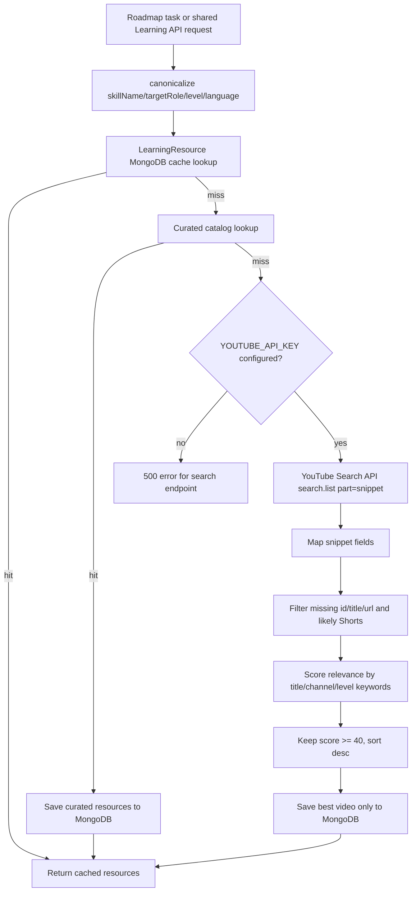
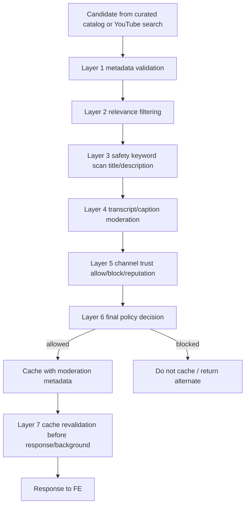

# YouTube Video Flow Audit

Pham vi: chi audit source hien tai. Khong sua code, khong thay doi API, khong them dependency.

# 1. Current flow



Roadmap flow:

```text
Roadmap task
-> buildLearningQueryFromTask
-> learningService.getLearningResources
-> if generate endpoint and missing: learningService.searchAndCacheYoutubeResources
-> cache/curated/YouTube search
-> roadmap item learning response includes learning.resources
```

Direct shared Learning flow:

```text
POST /api/learning/skills/:skillName/resources/search
-> canonical identity
-> MongoDB LearningResource cache
-> curated catalog
-> YouTube Search API
-> filter/rank
-> save best resource
-> response
```

# 2. Files and functions involved

| File | Function | Vai tro trong flow |
|---|---|---|
| `src/routes/learning.routes.js` | route declarations | Public shared learning endpoints: get resources, save manual resource, search/cache YouTube resources. Lines 253, 254, 365. |
| `src/controllers/learning.controller.js` | `getLearningResources`, `saveLearningResource`, `searchAndCacheYoutubeResources` | Doc request params/body va goi learning service. Lines 27, 42, 54. |
| `src/services/learning.service.js` | `buildLearningIdentity` | Canonicalize skillName/targetRole/level/language. Lines 38-53. |
| `src/services/learning.service.js` | `buildResourceQuery` | Tao cache query cho resource theo normalized skill/role/level/language/type. Lines 83-94. |
| `src/services/learning.service.js` | `sortResources` | Doc MongoDB cache va sort curated/manual/youtube theo priority + score. Lines 232-249. |
| `src/services/learning.service.js` | `getLearningResources` | Tra resource cache cho FE. Lines 252-284. |
| `src/services/learning.service.js` | `saveLearningResource` | Cho phep seed/update resource manual/curated/youtube_api bang title/url. Lines 294-341. |
| `src/services/learning.service.js` | `searchAndCacheYoutubeResources` | Cache lookup -> curated catalog -> YouTube search -> save best video. Lines 344-475. |
| `src/services/youtube.service.js` | `searchYoutubeVideos` | Goi YouTube Search API, map fields, filter, score, sort. Lines 62-112. |
| `src/services/youtube.service.js` | `calculateYouTubeVideoScore` | Cham diem relevance hien tai. Lines 11-59. |
| `src/services/youtube.service.js` | `isLikelyShort` | Filter Shorts dua tren title/url. Lines 5-9. |
| `src/services/learningResourceCatalog.service.js` | `findCatalogResources`, `isValidResourceUrl` | Lookup curated seed va validate URL co ban. Lines 5-27, 34-59. |
| `src/seeds/learningResources.seed.js` | module export | Curated video catalog. Lines 1-18 show catalog comment and first item. |
| `src/models/LearningResource.js` | `learningResourceSchema` | Schema cache video/resource. Lines 3-67. |
| `src/services/roadmapLearning.service.js` | `getResourcesForLearning` | Roadmap learning lay cached resources; generate flow co searchIfMissing. Lines 180-201. |
| `src/services/roadmapLearning.service.js` | `formatLearning`, `formatRoadmapItemLearningResponse` | Response roadmap item learning co `resources`. Lines 135-152, 204-222. |
| `src/services/ai/roadmap.prompt.js` | `buildRoadmapPrompt` | Roadmap AI prompt cam nhung link/video vao roadmap; Learning API xu ly resource rieng. Lines 47-48. |
| `src/services/ai/learning.prompt.js` | `buildLearningPrompt` | AI sinh learning content, khong sinh resource URL. Lines 39-82. |
| `scripts/testLearningCanonicalization.js` | test script | Test canonical cache key; khong test YouTube safety. Lines 1-69. |

# 3. Current YouTube API usage

## Endpoint

Backend chi goi:

```text
GET https://www.googleapis.com/youtube/v3/search
```

Source: `src/services/youtube.service.js`, `YOUTUBE_SEARCH_URL`, line 3; `axios.get`, line 70.

## Params

| Param | Current value | Source |
|---|---|---|
| `part` | `snippet` | `youtube.service.js` line 72 |
| `q` | `${skillName} tutorial for ${targetRole} ${level}` | `youtube.service.js` line 69 |
| `type` | `video` | `youtube.service.js` line 74 |
| `maxResults` | `4` | `youtube.service.js` line 75 |
| `key` | `process.env.YOUTUBE_API_KEY` | `youtube.service.js` line 76 |
| `relevanceLanguage` | request language, default `en` | `youtube.service.js` line 77 |

## Fields read

| Field | Read? | Source |
|---|---:|---|
| `videoId` | Yes | `item.id?.videoId`, line 83 |
| `title` | Yes | `item.snippet?.title`, line 84 |
| `description` | No | Not referenced in `youtube.service.js` |
| `channelTitle` | Yes | line 96 |
| `publishedAt` | Yes | line 97 |
| `thumbnails` | Yes | lines 92-95 |
| `duration` | No | Not available from `search.list snippet`; no `videos.list` call |
| `category` | No | No `videos.list` call |
| `madeForKids` | No | No `videos.list` call |
| `embeddable` | No | No `videos.list` call |
| `privacyStatus` | No | No `videos.list` call |
| `liveBroadcastContent` | No | Not read from snippet |
| `statistics` | No | No `videos.list` call |

## Quota impact

UNKNOWN in code. Source does not define quota accounting. It uses YouTube `search.list`, which has external quota behavior outside repo code.

# 4. Current filtering and ranking

## Filter rules implemented

Source: `src/services/youtube.service.js`.

1. Require `YOUTUBE_API_KEY`; otherwise throw 500-style error. Lines 63-67.
2. Search only `type=video`. Line 74.
3. Map `videoId`, `title`, `url`, `thumbnailUrl`, `channelTitle`, `publishedAt`. Lines 82-98.
4. Filter video with missing `videoId`, missing `title`, missing `url`. Line 101.
5. Filter likely Shorts if title contains `#shorts` or ` shorts`, or URL contains `/shorts/`. Lines 5-9 and 101.
6. Score relevance. Lines 102-110.
7. Keep `score >= 40`. Line 111.
8. Sort by score descending. Line 112.
9. Learning service saves only `videos[0]`, the best video. Lines 438-463.

## Scoring formula

Source: `calculateYouTubeVideoScore`, `src/services/youtube.service.js` lines 11-59.

```text
score = 0
if title contains skillName: +40
else: -30

if title contains one of:
  tutorial, course, crash course, full course, learn
then +20

if level == beginner and title contains one of:
  beginner, beginners, basic, basics, introduction, intro
then +15

if title contains one of:
  explained, guide, project, practical, hands-on
then +10

if channelTitle contains one of:
  freecodecamp, programming with mosh, traversy media,
  the net ninja, fireship, bytebytego, bro code, web dev simplified
then +10

if title does not contain skillName and title contains one of:
  roadmap, plan, become a developer, career, full stack developer
then -20

keep only score >= 40
```

## What this is

This is relevance filtering + lightweight channel-title bonus. It is not safety moderation, not video metadata validation, not transcript moderation, and not channel reputation verification.

# 5. Current cache behavior

## Cache key

MongoDB query fields:

```text
normalizedSkillName
normalizedTargetRole
level
language
type
```

Source: `src/services/learning.service.js`, `buildResourceQuery`, lines 83-94.

## Cache write

All writes use unique URL upsert:

```text
LearningResource.findOneAndUpdate({ url }, { $set: resourcePayload }, upsert)
```

Source: `src/services/learning.service.js`, `saveResourceByUrl`, lines 287-292.

## Cache priority/sort

`curated` priority 3, `manual` priority 2, default priority 1 (`youtube_api`), then `score`, then `createdAt`.

Source: `sortResources`, `src/services/learning.service.js`, lines 232-249.

## TTL/stale/revalidation

No TTL, no stale policy, no background revalidation found in `LearningResource` schema or learning service. `cachedAt` exists and is set, but not used for expiration/revalidation.

Source:
- `src/models/LearningResource.js`, `cachedAt`, line 64.
- `src/services/learning.service.js`, `cachedAt` set for curated and youtube_api, lines 405 and 463.

## Deleted/private/unavailable after cache

No revalidation before returning cached resources. If a cached YouTube URL later becomes deleted/private/not embeddable, current `getLearningResources` returns it from DB.

Source: `getLearningResources`, `src/services/learning.service.js`, lines 252-284.

# 6. Current response contract

## Shared learning endpoints

| Endpoint | Method | Purpose | Source |
|---|---|---|---|
| `/api/learning/skills/:skillName/resources` | GET | Return cached resources | `src/routes/learning.routes.js` line 253 |
| `/api/learning/skills/:skillName/resources` | POST | Save manual resource | `src/routes/learning.routes.js` line 254 |
| `/api/learning/skills/:skillName/resources/search` | POST | Load curated or search YouTube and cache | `src/routes/learning.routes.js` line 365 |

Controller returns `successResponse(res, result.message, result.data, result.statusCode)`.

Source: `src/controllers/learning.controller.js`, lines 29-36, 44-49, 56-63.

## Roadmap learning endpoints

| Endpoint | Method | Purpose | Source |
|---|---|---|---|
| `/api/roadmaps/:roadmapId/learning` | GET | Learning availability per roadmap task | `src/routes/roadmap.routes.js` line 679 |
| `/api/roadmaps/:roadmapId/learning/items/:itemId` | GET | Learning content/resources for one task | `src/routes/roadmap.routes.js` line 726 |
| `/api/roadmaps/:roadmapId/learning/items/:itemId/generate` | POST | Generate learning content and optionally search resources | `src/routes/roadmap.routes.js` line 769 |

## Resource fields returned

`LearningResource` documents include:

```text
skillName, canonicalSkillName, normalizedSkillName,
targetRole, normalizedTargetRole, level, language, type,
title, url, provider, thumbnailUrl, channelTitle,
publishedAt, tags, source, score, cachedAt,
createdAt, updatedAt
```

Source: `src/models/LearningResource.js`, lines 3-67; `canonicalizeStoredDocument`, `learning.service.js` lines 68-71.

# 7. What is currently validated

| Check | Implemented | How |
|---|---:|---|
| `skillName` required | Yes | `identity.skillName` check, `learning.service.js` lines 255-257 and 353-355 |
| Canonical skill key | Yes | `buildLearningIdentity`, lines 38-53 |
| Existing DB cache | Yes | `sortResources`, lines 232-249 |
| Curated before YouTube | Yes | `searchAndCacheYoutubeResources`, lines 357-425 |
| Curated URL non-empty/http/TODO filter | Yes | `isValidResourceUrl`, `learningResourceCatalog.service.js` lines 5-27 |
| YouTube API key exists | Yes | `youtube.service.js` lines 63-67; `learning.service.js` lines 427-429 |
| Search only videos | Yes | `type: 'video'`, `youtube.service.js` line 74 |
| Missing videoId/title/url | Yes | filter line 101 |
| Likely Shorts by title/url text | Partial | `isLikelyShort`, lines 5-9 |
| Relevance language hint | Partial | `relevanceLanguage`, line 77 |
| Skill name appears in title | Partial | scoring lines 17-23 |
| Learning keywords in title | Partial | scoring lines 25-38 |
| Beginner keyword for beginner level | Partial | scoring lines 30-33 |
| Known channel title bonus | Partial | scoring lines 40-52 |
| Score threshold | Yes | `score >= 40`, line 111 |
| Duplicate URL cache | Yes | unique URL index and upsert, `LearningResource.js` line 72; `learning.service.js` lines 287-292 |

# 8. What is not validated

| Missing check | Risk | Severity |
|---|---|---|
| `videos.list` existence/details revalidation | Deleted/private/unavailable cached videos can be returned | High |
| `contentDetails.duration` | Shorts/very long/live recordings can pass if title lacks Shorts marker | Medium |
| `status.embeddable` | FE may receive videos that cannot embed/play | High |
| `status.privacyStatus` | Private/deleted/unavailable videos can remain cached | High |
| `status.madeForKids` | Child-directed content may be returned without policy decision | Medium |
| `snippet.liveBroadcastContent` or live metadata | Live/upcoming streams can pass | Medium |
| Region restriction | Video may fail for user region | Medium |
| License/category validation | Non-educational category/license mismatch can pass | Low |
| Captions/transcript fetch | Cannot inspect actual content | High |
| Safety moderation title/description/transcript | Harmful/toxic/scam/malware content can pass | Critical |
| Description scan | Unsafe links/malware/scam in description not checked | Critical |
| Channel allow/block list with IDs | Impersonator channels with similar titles can get bonus | High |
| Subscriber count/verified/channel age | Channel trust not validated | Medium |
| Comments disabled/dislike/report signals | Not available in current flow; no check | Low |
| Cache TTL/revalidation | Bad/stale videos persist indefinitely | High |
| Wrong language verification | `relevanceLanguage` is only search hint; title/audio language not verified | Medium |
| Duplicate semantic videos | Only URL uniqueness; no per-query duplicate policy beyond cache | Low |
| AI-generated YouTube URLs in learning content | Prompt does not ask for resource URLs, but no explicit URL sanitizer in generated learning text | Low |

# 9. Toxic/harmful-content gap

## Co hay khong?

Current backend does not implement safety moderation for YouTube videos. It only performs relevance scoring and a small Shorts/title/url filter.

## Dang kiem tra title/description/transcript hay khong?

- Title: Yes, but only for relevance keywords and Shorts marker.
- Description: No. `searchYoutubeVideos` does not read `snippet.description`.
- Transcript/captions: No. No transcript/captions service or YouTube captions endpoint is used.
- Comments: No.
- AI moderation: No.
- Safety blocklist: No.

## Vi sao video doc hai van co the lot qua?

Because a video title can contain the requested skill and tutorial keywords, reach score >= 40, and still contain harmful/scam/malware/misinformation content in the description, transcript, video body, or channel. Current code never calls `videos.list`, never fetches transcript/captions, never moderates description/transcript, and never verifies channel identity by channel ID.

## Harm categories currently not checked

| Harm category | Current check |
|---|---|
| violence | NOT_IMPLEMENTED |
| self-harm | NOT_IMPLEMENTED |
| sexual content | NOT_IMPLEMENTED |
| hate | NOT_IMPLEMENTED |
| extremism | NOT_IMPLEMENTED |
| scam/phishing | NOT_IMPLEMENTED |
| malware | NOT_IMPLEMENTED |
| dangerous content | NOT_IMPLEMENTED |
| misinformation | NOT_IMPLEMENTED |
| spam/clickbait | PARTIAL: only generic career/roadmap penalty when skill missing |
| child-inappropriate content | NOT_IMPLEMENTED |
| irrelevant clickbait | PARTIAL: title skill/keyword score only |

# 10. Recommended moderation insertion points

Design only, no code changes proposed here.

1. Before cache read response: revalidate stale cached resources before returning.
2. After `search.list`: discard missing id/title/channel or obvious blocked title/channel entries.
3. After `videos.list`: validate existence, privacy, embeddable, duration, live status, region restrictions, madeForKids.
4. After description read: scan description for toxic/scam/malware/unsafe links.
5. After transcript fetch: moderate transcript/captions if available.
6. Before `saveResourceByUrl`: save only resources with final policy decision = allowed.
7. Before response: final guard checks cache resource moderation status.
8. Background revalidation: periodically recheck cached video availability/safety.

# 11. Recommended layered moderation architecture



Layer details:

| Layer | Purpose | Data needed |
|---|---|---|
| 1. Metadata validation | Confirm video exists/playable | YouTube `videos.list` |
| 2. Relevance filtering | Match skill/role/level/language | title, description, tags, transcript if available |
| 3. Safety keyword scan | Cheap blocklist/pre-filter | title, description, channel title |
| 4. Transcript moderation | Inspect actual spoken content | transcript/captions + moderation model |
| 5. Channel trust | Avoid impersonators/unsafe channels | channel ID, allowlist/blocklist, optional `channels.list` |
| 6. Final policy decision | Combine safety/relevance/trust | internal policy engine |
| 7. Cache revalidation | Prevent stale/deleted/bad cached video | cachedAt, moderation status, periodic `videos.list` |

# 12. Required external APIs/services

| Need | Required for robust solution? | Source/API |
|---|---:|---|
| Current search candidates | Yes | YouTube Data API `search.list` |
| Existence/privacy/embeddable/duration/live/category | Yes | YouTube Data API `videos.list` with `snippet,contentDetails,status,statistics` |
| Channel trust by ID/subscriber/verified-like signals | Optional but recommended | YouTube Data API `channels.list` |
| Transcript/captions content | Recommended for safety | Transcript provider or captions endpoint/third-party transcript fetch |
| Toxic/harmful content moderation | Recommended | OpenAI moderation, Gemini safety, or equivalent |
| Curated allowlist | Recommended | Internal curated catalog with manual review metadata |
| Manual review workflow | Recommended for high-trust resources | Internal admin/review process |
| External reputation source | Optional | External safety/reputation provider |

## YouTube Data API data available vs not available

Available via current `search.list` use:

- `id.videoId`
- `snippet.title`
- `snippet.channelTitle`
- `snippet.publishedAt`
- `snippet.thumbnails`

Available only if adding `videos.list`:

- `contentDetails.duration`
- `status.embeddable`
- `status.privacyStatus`
- `status.madeForKids` where exposed
- `snippet.categoryId`
- `snippet.liveBroadcastContent`/live metadata depending parts
- `statistics`
- region restriction/status metadata where exposed

Not reliably available from YouTube Data API alone:

- dislike/report signal
- full transcript unless captions/transcript access is added
- human safety judgment
- full channel reputation quality
- comments-disabled policy unless comment metadata endpoints are added
- whether video content is toxic without inspecting content/transcript

# 13. Test cases that should be added

Current repo has `scripts/testLearningCanonicalization.js`, which tests skill alias canonicalization/cache key behavior only. No source test found for private/deleted/Shorts/live/toxic/stale YouTube validation.

Recommended test cases:

1. `toxic title`: search result title contains harmful/scam/malware terms; expected blocked before cache.
2. `toxic description`: safe title, unsafe description from `videos.list`; expected blocked.
3. `harmful transcript`: safe metadata, unsafe transcript; expected blocked.
4. `private/deleted`: `videos.list` returns unavailable/private/deleted; expected not cached/returned.
5. `not embeddable`: `status.embeddable=false`; expected not returned to FE if FE embeds.
6. `Shorts`: duration <= 60s or Shorts URL/title marker; expected blocked depending policy.
7. `live`: live/upcoming stream; expected blocked unless policy allows.
8. `wrong language`: relevanceLanguage hint returns wrong-language title/transcript; expected blocked or downgraded.
9. `irrelevant`: title has generic career terms but no skill relevance; expected score below threshold.
10. `unsafe channel`: blocked channel ID/title; expected blocked even if title matches.
11. `stale cached video`: cached resource later becomes private/deleted; expected revalidated and removed/hidden.
12. `duplicate`: same URL appears for different query; expected deterministic cache behavior and no duplicate response.

# 14. Open questions

1. Should FE embed videos or only open links? This decides whether `embeddable` is mandatory.
2. Should Shorts be fully blocked by duration, or only downranked?
3. What max/min duration is acceptable per level?
4. Should live/upcoming streams be blocked?
5. Which languages are officially supported for video resources?
6. Should curated catalog be treated as manually reviewed, or still revalidated with YouTube metadata?
7. Who owns channel allowlist/blocklist maintenance?
8. What safety taxonomy should be enforced: school-safe, general audience, or professional-only?
9. Should cached videos expire by TTL, or be revalidated in background?
10. Should resources store moderation metadata and reason codes?
11. What fallback should be shown when all videos are blocked?
12. Should AI-generated learning content be scanned to ensure it does not contain URLs?
13. Should manual resources submitted through API require admin role or review?
14. Should YouTube quota failure return cached stale resources or fail closed?

# Vulnerability severity summary

| Severity | Gaps |
|---|---|
| Critical | No toxic/harmful content moderation; no description/transcript safety scan; unsafe links/scams/malware in description can pass. |
| High | No `videos.list` validation; deleted/private/not embeddable videos can be returned; no channel ID allow/block list; indefinite stale cache. |
| Medium | Shorts/live/wrong-language/region/duration/madeForKids not validated; title-only relevance can admit irrelevant clickbait. |
| Low | No semantic duplicate handling beyond URL uniqueness; no license/category/comments checks; roadmap AI prompt could include resources shape in JSON schema though rules say keep resources empty. |
